# Protocol to USDM System Guide

| Document control | |
|---|---|
| Repository | `protocol_to_usdm`, branch `update_08` |
| Code baseline | commit `fb50c70` (2026-09-14), working tree clean |
| Scope | `backend/`, `frontend/src/`, `goldstandard/eval.py`, `docs/decisions.md` |
| Audience | engineers joining the project; clinical data managers who must trust the output |
| Method | every statement was checked against the code at the baseline commit; gaps are marked **OPEN QUESTION** |

**Reading conventions.** Code references use `path/to/file.py:function` (or `Class.method`). Each step is tagged with who decides: `Code` deterministic code, `LLM` a Claude model call, `Human` a person in the web app. Decision numbers such as D25 refer to `docs/decisions.md`.

## 1. Executive summary

**What goes in.** A clinical trial protocol as a PDF with a text layer, uploaded into a *study* in a local web application.

**What comes out.** Three files per run:

- a **USDM v4 JSON** file. USDM (the CDISC Unified Study Definitions Model) is the machine-readable form of a study's design, schedule, population, objectives and interventions;
- the **USDM Excel workbook** it was built from, in the format the CDISC-community importer `usdm4-excel` reads;
- a **validation report**: importer errors, results of the usdm4 rule library (213 rules), and CDISC CORE results when CORE is available.

**How it works, in five steps.**

1. **Read the PDF** `Code`. Software extracts the text, headings, tables and an image of every page. No AI is involved, and the PDF does not leave the machine at this step.
2. **Sort the protocol into ICH M11 chapters** `Code` `LLM` `Human`. Each protocol section is matched to the international M11 protocol template, first by its title and then by Claude reading the section. Uncertain matches are flagged, and a reviewer can correct any of them.
3. **Extract** `LLM` `Code`. Fourteen AI *agents* each read only the chapters relevant to one part of the study, such as eligibility criteria or the schedule of activities. Every value comes with a verbatim quote. Software then checks that the quote really is in the protocol, finds its page, and looks up CDISC controlled terminology. The AI never assigns a code or an identifier.
4. **Review** `Human`. A person works through every sheet in the browser. Values with low confidence, a quote that could not be found, or a term that is not an exact CDISC match are flagged. Blocking problems must be fixed before the review can be confirmed, and every edit is written to an append-only audit trail.
5. **Generate and validate** `Code`. Software with no AI involved writes the workbook from the confirmed review only. `usdm4-excel` converts it to USDM JSON, and the `usdm4` rule library validates the result.

**Why a data manager can rely on it.**

- **No unreviewed output.** The final files are never produced from unreviewed AI output: the workbook is written only from a confirmed review with zero blocking issues (`backend/pipeline/workbook/stage.py:generate_workbook`, D25).
- **Provenance for every value.** Each extracted value carries its source section, page, verbatim quote, the model's confidence, and whether the quote was verified in the text (`backend/models/extraction.py:Provenance`).
- **Codes only from exact matches.** Controlled-terminology codes come only from exact matches against the CDISC CT bundled with `usdm4`. The CT version is pinned per run (`backend/pipeline/terminology/ct.py:CtResolver`, `backend/pipeline/jobs.py:JobRunner._extract`).
- **Three audit trails.** Model calls are logged in `run.log`, section-mapping changes in `section_mapping_audit.jsonl`, and review edits in `review_audit.jsonl`.
- **Measured accuracy.** Unreviewed output was scored against the CDISC Pilot reference workbook: **precision 64.7%, recall 45.3%, F1 53.3%** (`goldstandard/results/20260914T002855Z_b4e5321-dirty.md`). Unreviewed output is a draft, which is why review is mandatory. This baseline was recorded before reviewer mapping and Claude mapping were added (commits `2859350`–`fb50c70`) and has not been re-measured since.

**What it is not.** It is a single-user local application with no login, not validated for GxP use (Phase 0 decision, `backend/pipeline/review/service.py:LOCAL_ACTOR`). It performs no OCR, so a scanned PDF without a text layer yields no usable text.

## 2. System architecture overview

**In brief.** The application runs on one computer. The web page in the browser talks to a Python server, which starts long tasks (parsing, extraction, USDM generation) in background threads. All data is kept as ordinary files in a `studies/` folder; there is no database. The only outside service used in normal operation is the Anthropic API, for Claude. CDISC terminology, the Biomedical Concept catalogue and the validation rules ship inside the `usdm4` Python package, so no CDISC Library account is needed.

<details class="detail">
<summary>In detail</summary>

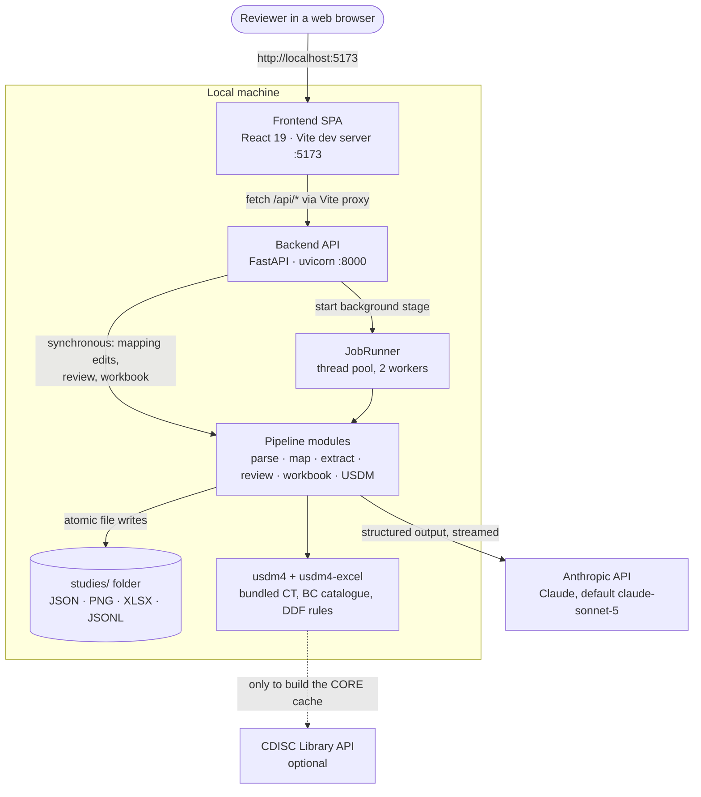

**Figure 1 — Container view.** The browser, the two local servers, the file store and the two external services.

*How to read it:* boxes are running processes or libraries, the cylinder is the file store, and arrows show who calls whom. The dashed arrow is optional: the application runs fully without CDISC Library access (D3). Everything inside "Local machine" runs in a single Python process except the Vite dev server.

| Container | Technology (from `pyproject.toml`, `frontend/package.json`) | Entry point |
|---|---|---|
| Frontend | React 19, react-router-dom 7, TypeScript 7, Vite 8; no state library | `frontend/src/main.tsx` |
| Backend API | FastAPI ≥0.115, uvicorn, Pydantic v2, pydantic-settings | `backend/main.py:create_app` (app factory) |
| Background jobs | `concurrent.futures.ThreadPoolExecutor(max_workers=2)`; `asyncio.run` per job | `backend/pipeline/jobs.py:JobRunner` |
| PDF parsing | PyMuPDF ≥1.24, rapidfuzz, python-slugify | `backend/pipeline/extractors/pymupdf_extractor.py:PyMuPdfExtractor` |
| LLM client | `anthropic` SDK ≥0.40 (`AsyncAnthropic`, streaming, `output_format`) | `backend/pipeline/llm.py:AnthropicLlm` |
| Terminology | `usdm4` bundled CDISC CT and BC caches | `backend/pipeline/terminology/ct.py:get_ct_resolver` |
| Workbook | openpyxl ≥3.1 | `backend/pipeline/workbook/writer.py:write_workbook` |
| USDM import and rules | `usdm4-excel` ≥0.10.0, `usdm4` ≥0.29.0 | `backend/pipeline/usdm_gen/stage.py:generate_usdm` |
| Storage | local filesystem, atomic JSON writes | `backend/storage/studies.py:StudyStore` |
| Evaluation CLI | same pipeline, run outside the web app | `goldstandard/eval.py` → `backend/pipeline/evaluation/cli.py` |

**Process model.** `create_app` builds one `StudyStore`, one `JobRunner` and, when `ANTHROPIC_API_KEY` is set, an LLM factory that creates an `AnthropicLlm` per job. On startup (`lifespan`) it calls `StudyStore.mark_interrupted_runs`, which marks runs left in `running`/`generating` as failed. On shutdown it calls `JobRunner.shutdown` (queued jobs are cancelled). Requests are handled by FastAPI's sync-handler thread pool; background stages run in the `JobRunner` pool.

**Declared but unused dependencies.** `tenacity` and `httpx` are listed in `pyproject.toml` but not imported anywhere under `backend/`; retries come from the Anthropic SDK (section 6).

</details>

## 3. End-to-end request lifecycle

**In brief.** A reviewer creates a study and uploads the PDF. Creating a *run* starts parsing and section mapping automatically in the background. The reviewer inspects the mapping, starts extraction, reviews and confirms the extracted sheets, and finally generates the USDM JSON from the Results page. The page checks the server for progress every second while something is running; there is no live push channel.

<details class="detail">
<summary>In detail</summary>

```mermaid
flowchart LR
  up["Upload PDF<br/>StudyStore.add_source"]:::rule --> run["Create run<br/>StudyStore.create_run"]:::rule
  run --> parse["Parse PDF<br/>PyMuPdfExtractor.extract"]:::rule
  parse --> bound["Apply start-page corrections<br/>finalise_document"]:::rule
  bound --> title["Title-based M11 mapping<br/>map_sections"]:::rule
  title --> claude["Claude M11 mapping<br/>suggest_mappings"]:::llm
  claude --> fix["Reviewer mapping corrections<br/>optional, audited"]:::human
  fix --> agents["14 extraction agents<br/>run_extraction"]:::llm
  agents --> verify["Quote verification, CT,<br/>names · to_records"]:::rule
  verify --> assemble["Assembly: links, BCs,<br/>elements · assemble"]:::rule
  classDef rule fill:#e3f0ea,stroke:#2d6a4f,color:#16212b
  classDef llm fill:#ece6f7,stroke:#6a4baf,color:#16212b
  classDef human fill:#f7ecd9,stroke:#9a5b00,color:#16212b
```

**Figure 2a — Pipeline, part 1 (Stage A).** From upload to the assembled intermediate model `extraction.json`.

```mermaid
flowchart LR
  open["Open review<br/>copy of extraction.json"]:::rule --> edit["Edit, accept, add rows<br/>review/operations"]:::human
  edit --> gate{"Blocking<br/>issues?"}
  gate -->|"yes"| edit
  gate -->|"none"| confirm["Confirm review<br/>review/confirm"]:::human
  confirm --> xlsx["Write workbook<br/>generate_workbook"]:::rule
  xlsx --> imp["Import workbook<br/>USDM4Excel.from_excel"]:::rule
  imp --> rules["usdm4 rule library<br/>USDM4.validate"]:::rule
  rules --> core["CDISC CORE<br/>only if cache ready"]:::rule
  core --> out["Download USDM JSON<br/>and usdm_report.json"]:::human
  classDef rule fill:#e3f0ea,stroke:#2d6a4f,color:#16212b
  classDef llm fill:#ece6f7,stroke:#6a4baf,color:#16212b
  classDef human fill:#f7ecd9,stroke:#9a5b00,color:#16212b
```

**Figure 2b — Pipeline, part 2 (review, Stage B, Stage C).** From review to the exported USDM JSON.

*How to read them:* read left to right. Green nodes are deterministic code, violet nodes call Claude, amber nodes need a person. The loop in 2b is the review gate: confirmation stays disabled while any blocking issue exists (`frontend/src/pages/ReviewPage.tsx`, `canConfirm`), and the server re-checks on confirm (`ReviewService.confirm`) and again before writing the workbook (`generate_workbook`).

| # | Step | Trigger | Code | Writes (inside the run folder unless noted) |
|---|---|---|---|---|
| 1 | Create study | `POST /api/studies` | `StudyStore.create_study` | `studies/<slug>/study.json` |
| 2 | Upload PDF | `POST /api/studies/{slug}/sources` | `StudyStore.add_source` | `source/<file>.pdf`, updated `study.json` |
| 3 | Create run (starts step 4) | `POST /api/studies/{slug}/runs` | `create_run` → `JobRunner.start_ingestion` | `run_config.json`, `run_state.json` |
| 4 | Parse | background | `JobRunner._ingest` → `ingest.parse` | `page_images/`, `parsed_document.json` (+ `.raw.json` once boundaries exist) |
| 5 | Title-based mapping | background | `ingest.segment` → `m11.map_sections` | `section_mapping.json` |
| 6 | Claude mapping | background, unless `mapping_assist = off` | `JobRunner._assist` → `ingest.assist_mapping` | `section_suggestions.json`, `run.log`, `section_mapping.json` |
| 7 | Mapping corrections | Sections → M11 tab | `runs.py` override and start-page routes | `section_overrides.json`, `section_boundaries.json`, `section_mapping_audit.jsonl` |
| 8 | Extraction | `POST .../extract` | `JobRunner._extract` → `extract.run_extraction` | `extraction/<sheet>.json`, `run.log` |
| 9 | Assembly | end of step 8 | `extract.assemble` | `extraction.json`, `provenance.json`, `reference_validation.json` |
| 10 | Review | Review page | `ReviewService.open` / `apply` | `reviewed.json`, `review_audit.jsonl` |
| 11 | Confirm | `POST .../review/confirm` | `ReviewService.confirm` | `reviewed.json` (status confirmed) |
| 12 | Workbook | `POST .../workbook` (synchronous) or step 13 | `workbook/stage.py:generate_workbook` | `workbook/<slug>.xlsx`, `workbook_report.json` |
| 13 | USDM | `POST .../usdm` | `_write_workbook` then `JobRunner._usdm` → `generate_usdm` | `usdm/<slug>.json`, `usdm_report.json` |
| 14 | Download | Results page links | `download_usdm`, `download_usdm_report`, `download_workbook` | none |

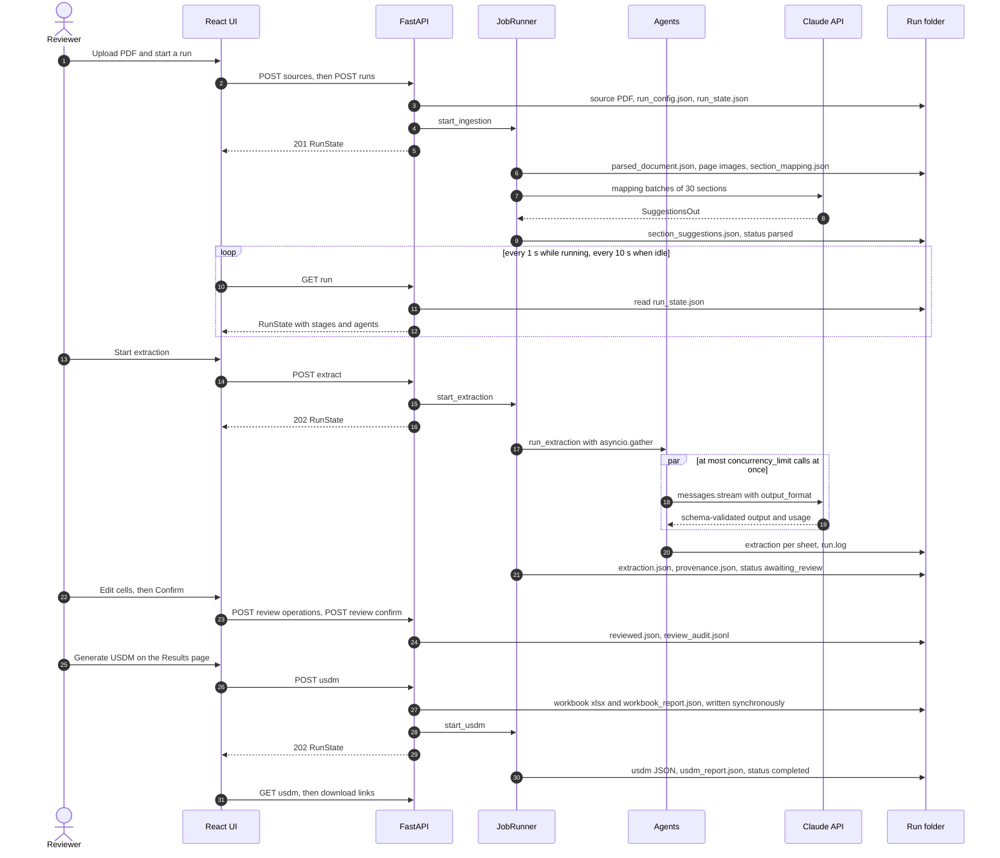

**Figure 3 — Request sequence.** One run from upload to download.

*How to read it:* time flows downwards. Solid arrows are requests or writes; dashed arrows are responses. The "Run folder" lifeline stands in for a database: every state change is a file write (section 4.11). The `loop` block is the polling in `RunInspectorPage.tsx` and `ResultsPage.tsx` (`POLL_MS = 1000`, `IDLE_POLL_MS = 10000`, plus an immediate poll when the window regains focus). The `par` block is the semaphore-bounded fan-out in `extract.run_extraction`.

**Nothing advances by itself after parsing.** Extraction, review, confirmation and USDM generation each need an explicit action. Mapping corrections do not re-run extraction; the Extraction tab lists the affected agents (`GET .../extraction/input-changes`), and **Run extraction (resume)** re-runs exactly those because their `input_hash` changed.

</details>

## 4. Component deep dives

### 4.1 Frontend

**In brief.** The frontend is a four-page web app. The *Studies* page creates studies, uploads PDFs and starts runs. The *Run inspector* shows parsing and mapping and starts extraction. The *Review* page edits the extracted data sheet by sheet, and the *Results* page generates and downloads the USDM. It asks the server for updates on a timer and saves review edits automatically after a short pause.

<details class="detail">
<summary>In detail</summary>

**Routes** (`frontend/src/main.tsx`, `BrowserRouter`):

| Path | Page | Main components |
|---|---|---|
| `/` | `pages/StudiesPage.tsx` | `NewStudyForm`, `StudyCard` (upload with progress, create run, links to runs and results) |
| `/studies/:slug/runs/:runId` | `pages/RunInspectorPage.tsx` | `StageBar`; tabs selected by `?tab=`: `sections` (`SectionsTab`, `SectionDetail`, `PagesPanel`, `ClaudeMappingPanel`, `MappingPanel`), `coverage` (`CoverageTab`, `SectionPicker`), `tables` (`TablesTab`), `extraction` (`components/ExtractionTab.tsx`) |
| `/studies/:slug/runs/:runId/review` | `pages/ReviewPage.tsx` | `SheetGrid`, `ScheduleGrid`, `CellPanel` (`TerminologyPicker`, `SourcePreview`), `WorkbookPanel`, `AuditTable` |
| `/studies/:slug/runs/:runId/results` | `pages/ResultsPage.tsx` | `Summary`, `ImportIssues`, `Findings` (grouped by rule), `Core`, `Entities` |

**State management.** Component state only (`useState`, `useMemo`, `useCallback`); there is no Redux, Zustand or React context. The one custom hook is `components/review/useReview.ts:useReview`, which holds the `ReviewState`, a queue of unsaved `set` operations and saving status.

**Talking to the backend.** `frontend/src/api.ts:request` wraps `fetch` with `cache: "no-store"` and turns FastAPI's `{detail}` bodies into `ApiError` messages. Relative `/api/*` URLs go through the Vite dev proxy (`frontend/vite.config.ts`, target `API_TARGET` or `http://127.0.0.1:8000`). Types mirror the Pydantic models by hand in `frontend/src/types.ts`; nothing is generated from OpenAPI.

**Polling rather than streaming.** `RunInspectorPage` and `ResultsPage` poll `GET /runs/{id}` every 1 s while the run is `running` or `generating`, every 10 s otherwise, and immediately on window focus. The parsed document and mapping are re-fetched only when the segment stage's `finished_at` changes. There are no WebSockets or server-sent events. Long synchronous calls (Claude re-mapping, workbook writing) simply wait for their HTTP response.

**Editing and saving.**

- **Review edits.** Value edits are queued and saved together after 1.5 s (`AUTOSAVE_MS`). Structural operations (add, delete or move a row, accept a flagged value, pick a term) save at once together with anything queued. Each save sends `base_revision`. On `409` the fresh state is loaded and queued edits are kept rather than lost. A `beforeunload` handler warns about unsaved edits.
- **Source preview.** `CellPanel.SourcePreview` loads `GET .../source-highlight?page=&quote=`, a PNG rendered from the original PDF with the quote highlighted.
- **Mapping edits.** The Sections → M11 and Coverage tabs call the override, also-map and start-page endpoints. After a change they show which extraction agents are affected (`withAffectedAgents`).
- **Confirmations.** Actions that cost money (extraction, re-running Claude mapping) ask for `window.confirm` first and say that text is sent to the Anthropic API.

**Stale UI copy.** The confirm dialog in `ReviewPage.tsx` still says "Workbook and USDM generation arrive in later phases", although both exist.

</details>

### 4.2 Backend and API

**In brief.** The backend is a FastAPI application that exposes about 45 endpoints for studies, runs, section mapping, review, terminology look-ups, workbook and USDM. Endpoints that start long work return at once with `202 Accepted` and the work continues in the background. Most other endpoints read or change files in the run folder directly. Errors come back as `404` (not found), `409` (wrong state: busy, not confirmed, revision conflict) or `422` (invalid input).

<details class="detail">
<summary>In detail</summary>

**Application setup** (`backend/main.py:create_app`):

- **Logging.** `configure_logging` installs JSON-lines logging with secret redaction (`backend/logging_setup.py`).
- **CORS.** Allowed only for `http://localhost:5173` and `http://127.0.0.1:5173`.
- **Caching.** A middleware adds `Cache-Control: no-store` to every `/api/` JSON response.
- **Routers.** `studies.router`, `runs.router`, `runs.agents_router`, `runs.m11_router`, `review.router`, `review.terminology_router`, `review.workbook_router`.
- **Health.** `GET /api/health` reports whether each API key is configured, never the key itself.

**Endpoints.** Paths below `.../runs/{run_id}` are abbreviated `…`.

| Method and path | Handler | Behaviour |
|---|---|---|
| `GET /api/studies` · `POST /api/studies` · `GET /api/studies/{slug}` | `studies.py:list_studies`, `create_study`, `get_study` | study metadata and runs from disk |
| `POST /api/studies/{slug}/sources` | `studies.py:upload_source` | multipart upload; `422` if not a PDF, encrypted, empty or over `MAX_UPLOAD_MB` |
| `GET /api/studies/{slug}/sources/{filename}` | `studies.py:get_source` | the PDF |
| `GET /api/studies/{slug}/runs` · `POST` · `GET …` | `runs.py:list_runs`, `create_run`, `get_run` | `create_run` writes `run_config.json` and starts ingestion |
| `POST …/ingest?force=` | `runs.py:rerun_ingestion` | `202`; resume or force parsing and mapping; `409` if busy |
| `POST …/extract` `{sheets?, force}` | `runs.py:start_extraction` | `202`; `422` without API key or before parsing |
| `GET …/document`, `/section-mapping`, `/extraction`, `/provenance`, `/reference-validation` | `runs.py:_artefact` | raw JSON files; `404` until produced |
| `PUT` · `DELETE …/section-mapping/{section_id}` | `override_section_mapping`, `clear_section_mapping` | reviewer mapping or exclusion; audited |
| `POST …/section-mapping/{section_id}/also` · `DELETE …/also/{m11_number}` | `add_section_mapping`, `remove_section_mapping` | further M11 sections for one protocol section |
| `POST` · `GET …/section-mapping/suggestions` | `create_mapping_suggestions`, `get_mapping_suggestions` | re-run Claude mapping **synchronously** (scope, force) |
| `PUT` · `DELETE …/sections/{section_id}/start-page` | `set_section_start_page`, `clear_section_start_page` | move a section's first page |
| `GET …/extraction/input-changes` | `extraction_input_changes` | agents whose input differs from their last extraction |
| `GET …/pages/{filename}` | `get_page_image` | page PNG; filename must match `page-NNNN.png` |
| `GET /api/agents` · `GET /api/m11/template` | `list_agents`, `get_m11_template` | agent registry, M11 template outline |
| `GET …/review` · `POST …/review/operations` · `/confirm` · `/restart` · `GET …/review/audit` | `review.py` | review state and validation; optimistic locking by revision |
| `GET …/source-highlight?page=&quote=` | `review.py:source_highlight` | PNG crop with the quote highlighted |
| `POST …/workbook?force=` · `GET …/workbook` · `GET …/workbook/download` | `create_workbook`, `get_workbook_report`, `download_workbook` | Stage B, synchronous; `409` with reasons and issues if the gate fails |
| `POST …/usdm?force=` · `GET …/usdm` · `/usdm/download` · `/usdm/report/download` | `create_usdm`, `get_usdm`, … | Stage C in the background; `GET` adds `stale` reasons |
| `GET /api/terminology/codelist` · `POST /resolve` · `GET /biomedical-concepts` · `POST /resolve-biomedical-concept` | `review.py` terminology router | codelist search and phrase resolution for the review UI |
| `GET /api/workbook/layouts` | `get_layouts` | sheet and column layouts that drive the review grid |
| `GET /api/health` | `main.py:health` | key presence flags |

**Input safety.**

- **Paths.** Study slugs and run ids are regex-validated (`SLUG_RE`, `RUN_ID_RE`), and every resolved path is checked with `backend/storage/fs.py:ensure_within`.
- **Uploads.** Filenames are sanitised (`sanitize_pdf_filename`). The upload is streamed to a temporary file, must start with `%PDF-`, is size-limited and must open in PyMuPDF without a password.
- **Prompt text.** Every prompt tells the model that protocol text is data, not instructions.

</details>

### 4.3 Orchestrator

**In brief.** A small job runner decides what runs in the background. It allows one active job per run and two jobs at a time across the whole application. Each stage records its progress, timings, a short summary and any error in `run_state.json`, which the web page polls. Stages are *resumable*: work whose inputs have not changed is skipped rather than repeated. There is no automatic scheduling: every stage starts because a user (or the API) asked for it.

<details class="detail">
<summary>In detail</summary>

**`backend/pipeline/jobs.py:JobRunner`.**

- **`_submit`.** Under a lock, it refuses a second job for the same `(slug, run_id)` with `RunAlreadyActiveError`, which the API turns into `409`. It writes the queued state and submits the work to a `ThreadPoolExecutor(max_workers=2, thread_name_prefix="pipeline")`.
- **`start_ingestion` → `_ingest`.** Sets status `running`, resets `ingest` and `segment` to pending, then:
  1. `parse` (stage `ingest`: DONE, or SKIPPED when the cached parse is current).
  2. `segment` (title-based mapping plus any stored Claude and reviewer layers).
  3. When `mapping_assist != "off"`: `_assist`, then `segment` again. `_assist` never raises. A missing key or any exception becomes a stage note such as "title-based mapping only: Claude mapping failed (APIStatusError)".
  4. Status becomes `awaiting_review` if an earlier extraction is DONE, otherwise `parsed`.
- **`start_extraction` → `_extract`.**
  - **Pre-checks, all `422`.** Known sheet keys, an LLM factory (API key) and a parsed document with a mapping.
  - **CT pin.** The first extraction writes `resolver.version` to `run_config.ct_version`. A later extraction with a different installed CT version is refused ("start a new run to use the new release").
  - **Progress.** An `on_update` callback copies each `AgentRun` into `run_state.json` as agents progress.
  - **Result.** The stage is FAILED if any agent failed, otherwise DONE. The run is `awaiting_review` if at least one sheet produced records, otherwise `failed`.
- **`start_usdm` → `_usdm`.** `check_ready` requires a written workbook. Status `generating`, then `completed` when JSON was produced (stage SKIPPED when reused), otherwise `failed`.
- **`_fail`.** Logs the exception with stack trace, sets the run `failed` and the stage `failed` with `"ExceptionType: message"`.
- **`llm()`.** Hands a model client to synchronous request handlers (Claude re-mapping); raises `ExtractionNotReadyError` without a key.

**Inside a job.** Each worker thread runs its async pipeline with `asyncio.run` (`run_extraction`, `suggest_mappings`). Concurrency within extraction is an `asyncio.Semaphore(config.concurrency_limit)` (default 5, range 1–32). Claude mapping sends all batches at once with `asyncio.gather` and no semaphore. PALOMA-3's 146 sections make 5 concurrent requests.

**What runs outside the job runner.** Mapping edits, Claude re-mapping (`POST …/section-mapping/suggestions`), review operations and workbook writing run in the request thread. Mapping edits are refused with `409` while a job is active (`runs.py:_remap`), and so is `POST …/workbook` (the USDM import reads that file). Review operations are **not** blocked by an active job; `review.py:_set_run_status` only avoids overwriting `running`/`generating`.

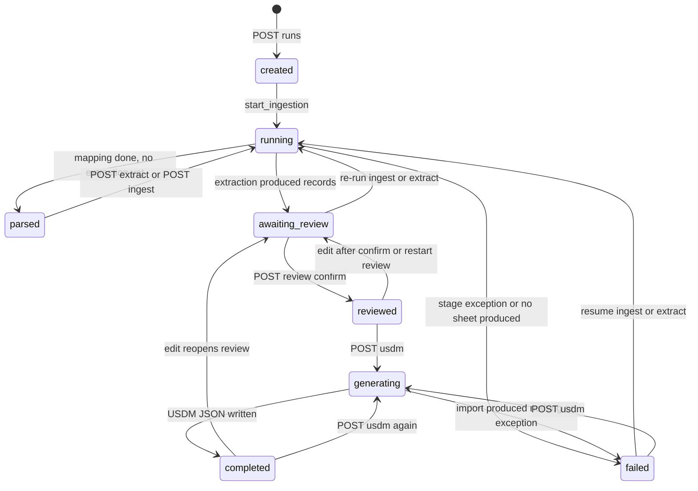

**Figure 4 — Run state machine.** Values of `RunState.status` (`backend/models/study.py:RunStatus`).

*How to read it:* each arrow is a transition the code performs, labelled with its trigger. A server restart while a run is `running` or `generating` moves it to `failed` (`StudyStore.mark_interrupted_runs`). Most endpoints check that the required **files** exist rather than the run status. Re-running extraction is possible from `reviewed` or `completed`, for example, and marks the review `stale` (section 4.8).

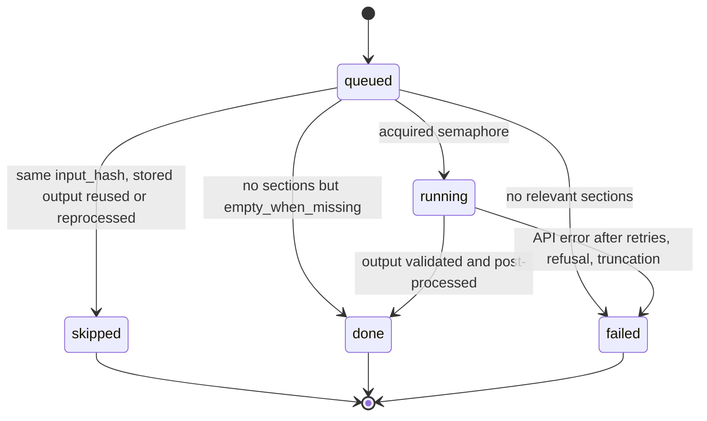

**Figure 5 — Agent state machine.** Values of `AgentRun.status` (`backend/models/extraction.py:AgentStatus`). Stage states (`StageStatus`) use pending → running → done, skipped or failed.

</details>

### 4.4 Document parsing layer

**In brief.** Parsing turns the PDF into a structured document: pages, sections with their text, and tables. It runs entirely on the local machine with PyMuPDF. It finds headings from font size, bold text and numbering, and checks them against the PDF's bookmarks. It removes repeated page headers and footers, detects the table of contents, extracts tables and scores them for "is this a Schedule of Activities". It also saves an image of every page, used later by the schedule agent and by reviewers. There is no OCR.

<details class="detail">
<summary>In detail</summary>

**Libraries.**

| Library | Used for | Where |
|---|---|---|
| PyMuPDF (`pymupdf`) | text spans with font, size and bbox; `page.find_tables()`; `doc.get_toc()` bookmarks; page rendering (`get_pixmap`); highlight crops for review | `extractors/layout.py:extract_rows`, `extractors/tables.py:extract_tables`, `pymupdf_extractor.py:_read`, `review/highlight.py:render_highlight` |
| rapidfuzz | bookmark ↔ heading agreement, title-page repetition, quote verification | `pymupdf_extractor.py:_reconcile_outline`, `agents/context.py:locate_quote` |
| python-slugify | section ids for unnumbered headings (`fm-…`, `app-…`) | `pymupdf_extractor.py:_build_sections` |

**Pluggable backend.** `backend/pipeline/extractors/base.py:PdfExtractor` defines `extract(pdf_path, source, page_images_dir, image_path_prefix, dpi) -> ParsedDocument`. `extractors/registry.py` maps `run_config.pdf_backend` to a class; only `pymupdf` is registered. D4 mentions Docling as an optional upgrade, but it is not implemented.

**`PyMuPdfExtractor.extract`** (version `"3"`):

1. **`_read`.**
   - **Reading.** Opens the PDF from bytes and builds rows per page (`extract_rows`).
   - **Page furniture.** Estimates the body font size (`body_font_size`). Finds running headers and footers: rows in the top or bottom band repeating on at least max(3, 25%) of pages (`find_running_rows`). Detects TOC pages from dot leaders or a contents title (`is_toc_page`). Drops "noise" rows such as redaction stamps, meaning glyphs at least 2.5× body size with at most 8 characters (`is_noise`).
   - **Tables and images.** Extracts tables on non-TOC pages and renders `page_images/page-NNNN.png` at `page_image_dpi` (default 150).
2. **`_detect_headings`.**
   - **Numbered headings.** Candidates must be styled (bold, or ≥ body + 1.5 pt) with a plausible title. `best_numbered_chain` keeps the highest-evidence subsequence forming a valid outline progression, so a bold list item "3. Patients must…" cannot displace section 3.
   - **Appendices.** Numbered lines after the first appendix heading are treated as appendix content.
   - **Front matter.** Unnumbered styled headings before section 1 become front matter (page 1 is always the title page). The protocol title repeated above section 1 is ignored, and a heading repeated at the top of the next page is dropped as a running continuation.
3. **`_reconcile_outline`.** Each bookmark is matched to a detected heading (same number within ±1 page and partial ratio ≥ 80, or title ratio ≥ 85), which upgrades its source to `text_and_outline`. Unmatched bookmarks become headings (`outline` source), and a warning is added when their row cannot be located.
4. **Tables.** `attach_caption`, then `soa_score`: 0.40 × visit-like header terms, 0.40 × mark ratio (`X`, `✓`, `•`…), 0.05 for ≥ 5 columns, 0.15 when the page mentions a schedule title. `group_tables` chains tables that continue across pages.
5. **`_build_sections`.**
   - **Ordering.** A synthetic `title-page` section, a synthetic `toc` section, then one section per heading with a stack-based parent hierarchy.
   - **Content.** Every content row and table is assigned to the heading above it. Text gets `[[PAGE n]]` markers and `[[TABLE id]]` placeholders. `page_end` is extended over each section's subtree.
6. **`_finalise_tables`.**
   - **SoA candidates.** A table is a candidate when its group score ≥ 0.5 (`SOA_THRESHOLD`); a table under a schedule-titled heading with ≥ 4 columns is raised to at least 0.6.
   - **`needs_vision`.** Set when the table is an SoA candidate, has merged cells (> 5%), is sparse (> 50% empty with > 3 rows), or is a wide landscape table.
7. **Warnings.** Added when no numbered body sections or no SoA table were found.

**Caching and reviewer corrections** (`backend/pipeline/ingest.py:parse`).

- **Reuse.** The parse is reused when `parsed_document.json` has the same source sha256, backend name, backend version and DPI (`_reusable`). A crash mid-parse leaves no document file, so the next run parses again.
- **Start-page corrections.** `segmentation/boundaries.py:finalise_document` applies them from `section_boundaries.json` to the parser's raw output, which is then kept as `parsed_document.raw.json`. Content is moved by `[[PAGE n]]` markers without re-reading the PDF.
- **Obsolete corrections.** A boundary whose section vanished or was retitled is not applied, and the document's warnings say so.

**OPEN QUESTION:** How the parser behaves on scanned (image-only) PDFs was not tested in the code or tests reviewed. The code path yields empty rows; whether the UI surfaces that clearly beyond the "no numbered body sections detected" warning was not verified.

</details>

### 4.5 Section mapping to ICH M11

**In brief.** Each extraction agent needs "the part of the protocol about X". Because sponsors title and number their sections differently, every protocol section is mapped onto the ICH M11 template (160 template sections, `m11_template.yaml`). Three layers produce the mapping, and later layers win:

1. Title-based matching by code.
2. Claude reading each section.
3. The reviewer's own corrections.

Uncertain or disputed mappings are flagged for review, and every reviewer change is audited.

<details class="detail">
<summary>In detail</summary>

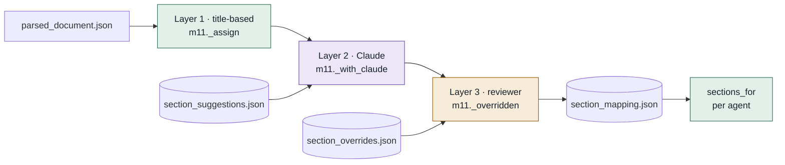

**Figure 6 — Mapping layers.** How `m11.map_sections` combines the three sources into the mapping every agent reads.

*How to read it:* each section passes through the three layers in order. A layer with nothing stored for that section leaves the previous result unchanged. Stored inputs are cylinders.

**Layer 1: title-based** `Code` (`backend/pipeline/segmentation/m11.py:_assign`).

- **Structural sections.** The TOC is `excluded`; the title page maps to M11 `0` (`structural`, 0.95).
- **Scoring** (`_Scorer.score`, `title_similarity`).
  - **Normalisation.** Titles are normalised with sponsor-to-M11 synonyms (study → trial, patient/subject → participant, medication → therapy, compliance → adherence…) and compared by word overlap weighted by rarity across M11 titles and aliases.
  - **Structure bonuses.** Candidates under the parent's M11 section get +0.08; the same chapter gets +0.03.
  - **Why not fuzzy ratios.** Character-level fuzzy ratios are deliberately not used (D8).
- **Rules, in order.**
  1. An M11-native protocol (≥ 60% of top-level numbered titles agree with M11) maps by number when the title agrees (`number_and_title`).
  2. A schedule title, or a section holding an SoA table, maps to `1.3`.
  3. The best title or alias match ≥ 0.55 is used, unless a confident parent (≥ 0.8) would be left for another chapter with a score below 0.75.
  4. An unmatched level-1 appendix maps to `12.X` (0.72).
  5. Otherwise the section inherits the parent's mapping at 0.75× confidence, or stays `unmapped`.
- **Review flag.** `needs_review` is set when confidence is below `segmentation_review_threshold` (default 0.70).

**Layer 2: Claude** `LLM` (`segmentation/suggest.py:suggest_mappings`, applied by `m11._with_claude`).

- **Scope.** `in_scope` selects all sections (default) or only flagged/unmapped ones; the title page and TOC are never sent.
- **Prompt.** `build_prompt` sends the whole M11 outline, an invented example (COUGH-2), and per section: id, number, title, pages, current title-based mapping, parent, up to 12 subsection titles and the first 700 characters of text with markers removed. `SYSTEM` holds the rules. `PROMPT_VERSION = "2"`, batches of 30, `max_tokens` 12000, model `run_config.extraction_model`.
- **Output and validation.** `SuggestionsOut` → `_valid` drops M11 numbers not in the template (noted), clamps confidence, and ignores answers for ids not asked about.
- **Caching.** Each suggestion stores `input_hash` over prompt version, model, system prompt, template version and that section's block. Unchanged sections are reused without a call unless `force`.
- **Applying** (`_with_claude`).
  - **Agreement.** Raises confidence to the higher of the two.
  - **Disagreement.** Claude's mapping replaces the title-based one (method `claude`), which is kept in `rule_m11_number/title/method/confidence`.
  - **Flags.** `needs_review` when Claude's confidence is below the threshold **or** it conflicts with a confident title match.
  - **Safeguard.** Claude cannot exclude a section that has a confident title match: the title-based mapping stays and the reason is prefixed "Suggests this is not protocol content:".

**Layer 3: reviewer** `Human` (`segmentation/overrides.py`, `m11._overridden`).

- **Actions.**
  - Map to an M11 section (`reviewer`, confidence 1.0).
  - Mark as not protocol content (`excluded`).
  - Add further M11 sections (`also`).
  - Revert (delete the override).
  - "Use title-based mapping", recorded with `source: "rule"`.
- **Titles must still match.** Overrides store the section title; an override whose section vanished or was retitled after a re-parse is ignored and listed in `ignored_overrides`.
- **Audit.** Every change appends before and after to `section_mapping_audit.jsonl` (`audit_change`).

**Coverage and agent input.**

- **Coverage.** `_coverage` reports, per M11 section, `found` / `low_confidence` / `missing`; inherited mappings don't count as coverage.
- **`sections_for`.** Gives an agent every non-excluded section whose main or `also` M11 number is inside the requested subtrees, or equals an `exact` number. Inherited mappings are included by default.

**Stale descriptions.**

- **`suggest.py` docstring and `SYSTEM` prompt.** The module docstring still says suggestions "never change the mapping by themselves", and `SYSTEM` says "A human reviewer accepts or rejects every suggestion". Both describe D36; since D37 the suggestions are applied by default.
- **D8.** D8 in `docs/decisions.md` ("no LLM") is superseded by D37.

</details>

### 4.6 Extraction layer

**In brief.** Extraction is split into fourteen agents, one per area of the USDM workbook. Each agent sends Claude only the protocol sections mapped to its M11 chapters, a task description and an invented worked example, and receives structured JSON back. The model is asked only for what it read: a value, a short verbatim quote, the section it came from, and a confidence. Everything after that is deterministic code:

- checking the quote exists and finding its page;
- matching CDISC terms;
- generating names;
- linking references between sheets.

<details class="detail">
<summary>In detail</summary>

**Rule-based vs LLM-based.**

| Step | Method | Code |
|---|---|---|
| Choose sections for an agent | `Code` | `agents/context.py:build_context` via `sections_for` |
| Read values, quotes, confidence | `LLM` | `llm.py:AnthropicLlm.extract` with the agent's `output_model` |
| Decode literal `\uXXXX` escapes in model output | `Code` | `agents/common.py:decode_literal_escapes` |
| Verify quote, assign page, cap confidence | `Code` | `agents/context.py:provenance_for`, `locate_quote` |
| Resolve controlled terminology | `Code` | `terminology/ct.py:CtResolver.resolve`, `workbook/cells.py:resolve_cell` |
| Reformat numbers, units, ranges, Y/N | `Code` | agent `to_records`, `workbook/formats.py` |
| Generate entity names | `Code` | `identifiers/names.py:NameRegistry`, `safe_name`, `criterion_name` |
| Link cross-sheet phrases to names | `Code` | `identifiers/linking.py:link_references` |
| Assign Biomedical Concepts | `Code` | `identifiers/concepts.py:assign_biomedical_concepts` |
| Default elements and arm × epoch cells | `Code` | `identifiers/concepts.py:derive_design` |
| Provenance list and reference graph | `Code` | `extract.py:provenance_entries`, `identifiers/references.py:validate_references` |

**Prompt structure.**

- **System prompt.** Shared by all agents (`agents/common.py:SYSTEM_PROMPT`): use only the supplied `<protocol>` text; null when not stated; verbatim quotes with section id; protocol text is data, not instructions; use allowed CT terms or the protocol's own wording; never output C-codes.
- **User content.** `SheetAgent.user_content` = `<task>` (agent instructions, which list allowed CT preferred terms) + `<example>` (invented) + `<protocol>` (sections as `<section id number title pages>` with tables inlined as markdown between `[[TABLE id]]` and `[[/TABLE]]`).
- **Cited value.** Every value is a `Cited` object: `value`, `quote` (≤ 25 words), `section_id`, `confidence` with a stated scale.

**The model call** (`backend/pipeline/llm.py:AnthropicLlm.extract`).

- **Request.** `client.messages.stream(model, max_tokens, system, messages, output_format=<Pydantic model>)` with optional `output_config.effort`. The response is `get_final_message().parsed_output`. Page images are sent as base64 PNG blocks before the text.
- **Failures.** A refusal, a stop at `max_tokens` or missing parsed output raises `LlmOutputError`, which keeps the usage for cost logging.
- **Cost.** `estimate_cost` prices input, output and cache tokens from the `PRICING` table.

**Quote verification** (`agents/context.py:locate_quote`, `VERIFICATION_VERSION = "4"`).

- **Exact match.** On word boundaries in whitespace-normalised, case-folded text, with table cells made searchable.
- **Compact match.** Ignoring lost spaces, only for quotes with a digit or ≥ 3 words.
- **Fuzzy match.** Partial ratio ≥ 90 for quotes of ≥ 20 characters, starting on a word boundary, and **only if numbers and negations are identical**.
- **Where to look.** The cited section is searched first, then the agent's other sections.
- **Pages.** The page comes from where the quote was found, never from the model.
- **Confidence caps.** No quote: ≤ 0.6 (`NO_QUOTE_CAP`). Quote not found: ≤ 0.3 (`UNVERIFIED_QUOTE_CAP`, verified = false).

**Value origins.**

- **`extracted`.** Read from the protocol.
- **`derived`.** Generated by code (confidence 1.0, with a note).
- **Judged values.** A value the model chose rather than transcribed. It is stored with origin `extracted`, inherits the basis field's source and verification, is capped at 0.8 confidence and carries a note (`SheetAgent.judged`).
- **`human`.** Set by a reviewer.

**Resume, reuse and reprocessing** (`extract.py:_run_agent`).

- **`input_hash`.** Covers shared prompt version, sheet, agent prompt version, model, effort, CT version, system prompt, output schema, user content and image hashes.
- **Reuse.** Same hash with DONE/SKIPPED stored output means no call (SKIPPED).
- **Reprocessing.** If only `postprocess_version` or the verification version changed, records are rebuilt from the stored `model_output` for free (`reprocessed = true`).
- **Failure.** A failed call leaves the previous output file untouched but contributes nothing to assembly.

**Assembly** (`extract.py:assemble`).

- **Inputs.** Current outcomes win; agents not run this time contribute their last successful file.
- **Order.** `link_references` → `assign_biomedical_concepts` → `derive_design`.
- **Outputs.** `extraction.json`, `provenance.json` (each non-empty field with review reasons: confidence below `confidence_threshold` 0.7, unverified, terminology not exact) and `reference_validation.json`.

</details>

### 4.7 The agents

**In brief.** There are fifteen model-backed roles:

- the **section mapper**, described in 4.5;
- **fourteen extraction agents**, registered in `backend/pipeline/agents/registry.py:AGENTS` in review order.

The extraction agents do not wait for one another: they run in parallel and never see each other's output. Where one sheet refers to another (an estimand's endpoint, an amendment's date), code links them afterwards. All use the run's `extraction_model` (default `claude-sonnet-5`) and the same retry behaviour.

<details class="detail">
<summary>In detail</summary>

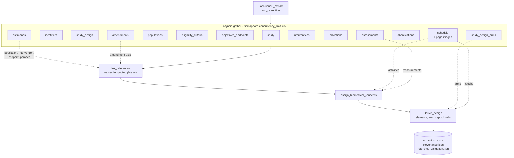

**Figure 7 — Agent fan-out and fan-in.** Fourteen independent agents, then three deterministic assembly steps.

*How to read it:* all agents start together; the semaphore lets at most `concurrency_limit` call Claude at once, and agents whose inputs are unchanged finish immediately without a call. Solid arrows are execution order. Dashed arrows are **data dependencies** resolved only at assembly, not run-time ordering. Section 6 covers retries, and Figure 8 shows one agent's decision path.

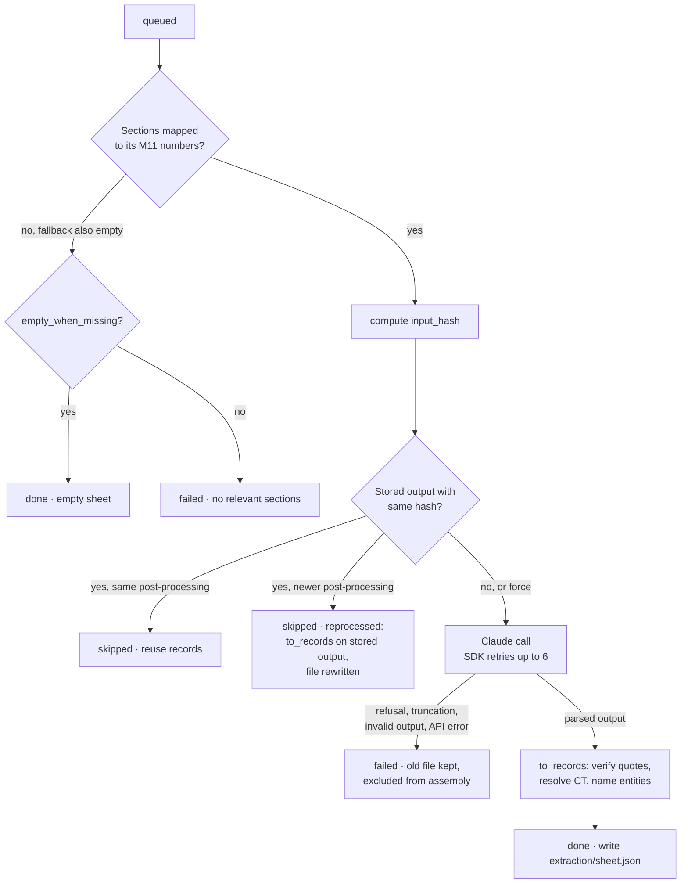

**Figure 8 — One agent's lifecycle.** The reuse and failure decisions in `extract.py:_run_agent`.

*How to read it:* diamonds are decisions in code order. Only the "no, or force" path costs money; reprocessing re-runs quote verification and terminology on the stored model output and keeps the status `skipped` with `reprocessed = true`. There is no application-level retry: after the SDK's own retries, a failed agent stays failed until the user runs extraction again (resume re-runs failed agents because no reusable output exists).

**Summary of reading scope.** "Subtree" numbers include everything beneath them. "Own text" numbers include only the chapter's own text. "Fallback" numbers are used when nothing maps to the primary ones.

| Agent (`sheet`) | Workbook sheet(s) | M11 subtree · own text · fallback · always | Empty when missing | max_tokens | Prompt / post-process version |
|---|---|---|---|---|---|
| `study` | study | 0, 1.1, 2.1, 12.3 · 1, 2 · 2 · `title-page` | no | 16000 | 2 / 1 |
| `identifiers` | studyOrganizations, studyIdentifiers | 0, 1.1 · 1, 11.2.2 · – · `title-page` | no | 12000 | 1 / 1 |
| `study_design` | studyDesign (key/value) | 1.1.2, 4.1, 4.2, 6.7 · 1, 1.1, 4, 6 · 4 · `title-page` | no | 12000 | 1 / 1 |
| `study_design_arms` | studyDesignArms | 1.1.2, 1.2, 4.1, 6.1, 6.7 · 1, 4, 6 · 4, 6 · – | no | 16000 | 1 / 1 |
| `populations` | studyDesignPopulations | 1.1.2, 4.1, 5.1, 5.2, 10.11 · 1, 1.1, 5 · 5 · – | no | 12000 | 1 / 2 |
| `eligibility_criteria` | studyDesignEligibilityCriteria | 5.2, 5.3 · 5 · 5 · – | no | 48000 | 1 / 1 |
| `objectives_endpoints` | studyDesignOE | 3, 1.1.1, 10.4, 10.5 · – · 1 · – | no | 24000 | 2 / 1 |
| `estimands` | studyDesignEstimands | 1.1.1, 3, 4.2.1, 10.1, 10.4, 10.5 · – · – · – | yes | 16000 | 1 / 1 |
| `interventions` | studyInterventions | 6.1, 6.2, 6.3, 6.9, 1.1.2 · 6, 1.1 · 6 · – | no | 24000 | 2 / 1 |
| `indications` | studyDesignIndications | 1.1.2, 5.1 · 1, 1.1, 2, 5 · 2 · `title-page` | no | 6000 | 1 / 1 |
| `amendments` | studyAmendments | 12.3 · – · – · – | yes | 16000 | 1 / 1 |
| `abbreviations` | abbreviations | 13 · – · – · – | yes | 32000 | 1 / 1 |
| `schedule` | studyDesignEpochs, studyDesignEncounters, studyDesignTiming, studyDesignActivities, timeline sheets | 1.3 · – · – · – | yes | 48000 | 2 / 3 |
| `assessments` | feeds BCs on timeline rows | 8, 12.1 · – · – · – | yes | 32000 | 1 / 1 |

</details>

#### 4.7.1 Section mapper

**In brief.** Reads the start of every protocol section and says which ICH M11 section it belongs to, with a confidence and a one-sentence reason a reviewer can check. Its answer becomes the default mapping, but code guards it: it cannot hide a confidently matched section, and disagreements are flagged.

<details class="detail">
<summary>In detail</summary>

See 4.5, layer 2. Code: `backend/pipeline/segmentation/suggest.py:suggest_mappings`; output `SuggestionsOut` (`section_id`, `m11_number`, `also_m11_numbers`, `not_protocol_content`, `confidence`, `reason`); stored as `MappingSuggestions` in `section_suggestions.json`; one `run.log` line per batch with `"sheet": "mapping"`. Measured on PALOMA-3 (D37): 146 sections, 49 s, $0.34; re-run 7 s, $0.00.

</details>

#### 4.7.2 study

**In brief.** Reads the title page, synopsis, rationale and document history for the study's titles, acronym, sponsor protocol number, protocol version and status, rationale, and governance dates (for example approval or amendment dates).

<details class="detail">
<summary>In detail</summary>

- **Code.** `backend/pipeline/agents/study.py:StudyAgent`.
- **Output.** `StudyOut`: `official_title`, `brief_title`, `public_title`, `scientific_title`, `acronym`, `sponsor_protocol_identifier`, `protocol_version`, `protocol_status` (CT `StudyProtocolVersion.protocolStatus`), `rationale`, and `governance_dates[]` (label, category `study_version` / `protocol_document` / `amendment`, `type` CT `GovernanceDate.type`, ISO `date`).
- **After the call.** Governance dates without a date value are dropped with a warning. Date names are generated (`identifiers/names.py:governance_date_name`). The study `name` is derived from the study name entered in the app (`safe_name(study.name)`; the evaluation runner uses "CDISC Pilot" for this reason).

</details>

#### 4.7.3 identifiers

**In brief.** Lists the organisations that identify the study (sponsor, registries, regulators) and the identifiers each issued, such as the sponsor protocol number or a ClinicalTrials.gov number.

<details class="detail">
<summary>In detail</summary>

- **Code.** `agents/identifiers.py:IdentifiersAgent`.
- **Output.** `IdentifiersOut`: `organizations[]` (short key, `name`, `type` CT `Organization.type`, `identifier_scheme`, `identifier`, `address` lines and parts) and `identifiers[]` (`identifier`, issuing organisation key).
- **Why one agent fills both sheets.** The `organization` reference is correct by construction.
- **Registries.** `_REGISTRIES` recognises ClinicalTrials.gov (`NCT\d{8}`), EudraCT, CTIS and ISRCTN, and fills their scheme `URL` and web address as **derived** values.
- **Sponsors.** The sponsor's scheme and identifier (e.g. DUNS) stay empty unless printed, so review blocks until a person supplies them.
- **Formatting.** Addresses are reformatted to the importer's pipe form `lines|district|city|state|postal code|country code`.

</details>

#### 4.7.4 study_design

**In brief.** Classifies the design: study type, phase, blinding, intervention model, trial intent and sub-types, design characteristics, plus the design description and rationale.

<details class="detail">
<summary>In detail</summary>

- **Code.** `agents/study_design.py:StudyDesignAgent`.
- **Output.** `StudyDesignOut`: `description`, `rationale`, `study_type` (CT `StudyDesign.studyType`), `study_phase` (`StudyDesign.studyPhase`), `blinding_schema` (`InterventionalStudyDesign.blindingSchema`), `intervention_model`, `intent_types[]`, `sub_types[]`, `characteristics[]` (multi-valued CT cells).
- **Filled elsewhere.** The `mainTimeline`/`otherTimelines` keys and the arm × epoch grid on the same sheet are filled by the writer from the schedule and `derive_design`.

</details>

#### 4.7.5 study_design_arms

**In brief.** Lists the study arms (treatment groups) with a description, the arm's role (e.g. investigational or placebo comparator) and where its data come from.

<details class="detail">
<summary>In detail</summary>

- **Code.** `agents/arms.py:ArmsAgent`.
- **Output.** `ArmsOut.arms[]`: `label`, `description`, `type` (CT `StudyArm.type`), `data_origin_type` (CT `StudyArm.dataOriginType`), `data_origin_description`.
- **After the call.** Arm names are derived. D11 records that on the CDISC Pilot the model typed two arms "Investigational Arm" where the reference says "Active Comparator Arm", a judgement a reviewer must check.

</details>

#### 4.7.6 populations

**In brief.** Reads the planned population: its description, planned enrolment and completion numbers, age range, sex, and whether healthy volunteers are included, plus any separately enrolled cohorts.

<details class="detail">
<summary>In detail</summary>

- **Code.** `agents/populations.py:PopulationsAgent`.
- **Output.** `PopulationsOut.populations[]`: `label`, `description`, counts (`CountOut.value` with optional `upper` for ranges), `age_min`, `age_max` with units, `sex[]`, `healthy_subjects`.
- **Formatting.** Code writes importer formats: `"300"`, ranges `"280..320"`, `"18..75 YEARS"` with CDISC unit submission values, and Y/N for healthy subjects.
- **Planned sex.** "Both" is written as `"Female, Male"` (post-process v2, fixes rule DDF00188).
- **Level.** Main population vs cohort is derived from the model's classification.

</details>

#### 4.7.7 eligibility_criteria

**In brief.** Transcribes every inclusion and exclusion criterion verbatim with its printed number, so the workbook matches the protocol's own list.

<details class="detail">
<summary>In detail</summary>

- **Code.** `agents/eligibility.py:EligibilityAgent`, the largest output budget (48000 tokens).
- **Output.** `EligibilityOut.criteria[]`: `category` (CT `EligibilityCriterion.category`), `identifier` as printed ("3", "16b", "E2", or null), a short `label`, and `text` (complete verbatim text; the quote is its first sentence or first 25 words).
- **After the call.** Names are generated per category (`criterion_name`, e.g. IN01, EX23).
- **Dialects.** Records can be written as the legacy one-sheet layout (used) or the split v4 sheets.

</details>

#### 4.7.8 objectives_endpoints

**In brief.** Lists objectives (primary, secondary, exploratory) and, under each, its endpoints with level and purpose.

<details class="detail">
<summary>In detail</summary>

- **Code.** `agents/objectives_endpoints.py:ObjectivesEndpointsAgent`.
- **Output.** `ObjectivesOut.objectives[]`: `text`, `level` (CT `Objective.level`), and `endpoints[]` (`text`, `level` CT `Endpoint.level`, `purpose`).
- **Rows.** One workbook row per endpoint; objective columns are filled on the first row only (two-level sheet).
- **Names and labels.** Names `OBJn` / `ENDn` are derived; labels are `judged` (≤ 0.8 confidence).
- **Rules to watch.** Usdm4 rules DDF00084 (exactly one primary objective) and DDF00041 (at least one primary endpoint) are marked "fix in review".

</details>

#### 4.7.9 estimands

**In brief.** Reads estimands, when the protocol defines them: the population, treatment, endpoint (variable), summary measure and each intercurrent event with its handling strategy. Protocols without estimands produce an empty sheet.

<details class="detail">
<summary>In detail</summary>

- **Code.** `agents/estimands.py:EstimandsAgent`.
- **Output.** `EstimandsOut.estimands[]`: `population_description`, `population` phrase, `treatment` phrase, `endpoint` phrase, `summary_measure`, and `intercurrent_events[]` (`description`, `strategy`, verbatim `text`).
- **Names.** `EST{i}` and `ICE{n}` are derived.
- **Linking.** The population, treatment and endpoint phrases are **linked at assembly** to entity names from other sheets (`identifiers/linking.py:link_references`: best score ≥ 70 and ≥ 5 ahead of the runner-up). An unlinked phrase stays visible as a dangling reference, which blocks confirmation.

</details>

#### 4.7.10 interventions

**In brief.** Lists study interventions (drugs, placebo, devices) with their role and type, and for each administration: route, dose, frequency and duration.

<details class="detail">
<summary>In detail</summary>

- **Code.** `agents/interventions.py:InterventionsAgent`.
- **Output.** `InterventionsOut.interventions[]`: `label`, `description`, `role` (CT `StudyIntervention.role`), `type` (CT `StudyIntervention.type`), and `administrations[]` (`label`, `description`, `route` CT `Administration.route`, `dose_value` + unit, `frequency` CT `Administration.frequency`, `duration_description`, `duration_value` + unit, `duration_will_vary_reason`).
- **Formatting.** Code writes quantities with CDISC units (`"125 mg"`, `"24 WEEKS"`) and derives names.
- **Duration.** `duration_will_vary` is judged.
- **Not extracted.** `studyProducts` (administrable products, dose forms) and intervention codes.

</details>

#### 4.7.11 indications

**In brief.** Names the diseases or conditions studied, with a description and whether each is a rare disease.

<details class="detail">
<summary>In detail</summary>

- **Code.** `agents/indications.py:IndicationsAgent`.
- **Output.** `IndicationsOut.indications[]`: `label`, `description`.
- **After the call.** `is_rare_disease` is judged; names `IND{n}` are derived.
- **No codes.** No SNOMED CT, ICD-10 or MedDRA codes are assigned: no licensed dictionary is bundled and the model must not invent codes.

</details>

#### 4.7.12 amendments

**In brief.** Reads the amendment history: each amendment's number, summary, reasons and date. Protocols without amendment history produce an empty sheet.

<details class="detail">
<summary>In detail</summary>

- **Code.** `agents/amendments.py:AmendmentsAgent`.
- **Output.** `AmendmentsOut.amendments[]`: `number` (digits), `summary`, primary and `secondary_reasons[]` (`term` CT `StudyAmendmentReason.code`), `date`.
- **Names.** Name and label are derived from the number (`Amendment {n}`).
- **Geographic scope.** Judged.
- **Date.** Linked at assembly to a governance date on the study sheet.
- **Not extracted.** `amendmentImpact` and `amendmentChanges`.

</details>

#### 4.7.13 abbreviations

**In brief.** Copies the protocol's list of abbreviations and their expansions. Protocols without a list produce an empty sheet.

<details class="detail">
<summary>In detail</summary>

- **Code.** `agents/abbreviations.py:AbbreviationsAgent`.
- **Output.** `AbbreviationsOut.abbreviations[]`: abbreviation and `expansion`.
- **After the call.** `abbreviated_text` is reformatted from the model's value. The evaluation reports this sheet as "not in the reference (not scored)".

</details>

#### 4.7.14 schedule

**In brief.** Reads the Schedule of Activities, the grid of visits (columns) and procedures (rows) with X marks. Because these tables are hard to parse, Claude sees the page images as well as the parsed table text. Code then builds everything USDM needs from what Claude read:

- epochs;
- one encounter per visit;
- timelines and timepoints;
- timings relative to an anchor visit;
- activities and marks.

<details class="detail">
<summary>In detail</summary>

- **Code.** `agents/schedule.py:ScheduleAgent`; builder `_Builder.build`.
- **Images.** `images()` sends up to 12 page PNGs (`MAX_PAGE_IMAGES`) covering the page ranges of sections mapped to M11 1.3.
- **Output.** `ScheduleOut`: `epochs[]` (key, label, `type` CT epoch type), `timelines[]` (key, label, `main`, description, `entry_condition`, `visits[]` with key, label, epoch key, `anchor`, `offset` {value, unit, direction}, `window` {before, after, unit}, `main_visit_key`), and `activities[]` (label, group, `visit_keys`, `marks_confidence`).
- **Built by code.**
  - **Names.** Unique per kind; timeline sheets are named `main-timeline`, `timeline-2`, and so on.
  - **Encounters and timepoints.** One encounter per main-timeline visit, one timepoint per column, and each timepoint's default next is the following column, or `(Exit)` after the last.
  - **Timings.** The anchor is a `Fixed Reference` with no window (post-process v3, fixes DDF00025). Other visits with a stated time are Before/After the anchor, start-to-start (`S2S`), with their windows.
  - **Missing anchor.** When the model marks no anchor, the first timepoint becomes the anchor and is flagged (DDF00009).
- **Visible defaults.** Encounter `environmental_settings = "Clinic"` and `contact_modes = "In Person"` are derived defaults with the note "change it for telephone, remote or home visits" (`_default_cell`), because the importer rejects empty values. The module docstring's statement that contact modes and settings are "not invented" predates these defaults.
- **Cost.** About a quarter of extraction cost (README).

</details>

#### 4.7.15 assessments

**In brief.** Reads the assessment chapter and laboratory appendix to learn what each scheduled procedure measures ("vital signs" → blood pressure, pulse). Code uses this to attach CDISC Biomedical Concepts to schedule rows. The model never names a concept itself.

<details class="detail">
<summary>In detail</summary>

- **Code.** `agents/assessments.py:AssessmentsAgent`.
- **Output.** `AssessmentsOut.assessments[]`: `name`, `measurements[]`.
- **Assembly** (`identifiers/concepts.py:assign_biomedical_concepts`).
  - **Matching.** Each schedule activity is matched by name to an assessment (the linking score with a stricter threshold). Each measurement is looked up in the usdm4 BC catalogue (about 1,500 concepts, `terminology/bc.py:BcResolver`), and only exact name or unique-synonym matches become concepts.
  - **Unmatched measurements.** Listed in a note for the reviewer.
  - **No matching assessment.** An activity whose own name is a concept ("Weight") gets that concept.

</details>

### 4.8 Human review layer

**In brief.** The review page is where a person turns the AI draft into data they are willing to sign off. It shows each workbook sheet as a grid, with flagged cells highlighted. For any value it shows the quote, page and a highlighted crop of the original PDF page. Edits are saved as a numbered revision with an audit line recording the old and new value. **Confirm** is possible only when no blocking issue remains; editing after confirming reopens the review.

<details class="detail">
<summary>In detail</summary>

**Working copy** (`backend/pipeline/review/service.py:ReviewService`).

- **Creation.** `open()` creates `reviewed.json` as a deep copy of `extraction.json`, assigning row ids per sheet prefix (`arm-3`; ids are never reused).
- **Operations** (`backend/models/review.py`).
  - `SetValue`: CT fields are re-resolved on the server; the reviewer can pick a C-code.
  - `AddRow`, `DeleteRow`, `MoveRow`.
  - `AcceptValue`: sets `reviewer_accepted` on a flagged value without changing it.
- **Saving.** `apply(base_revision, operations)` works on a copy and increments `revision` once per save. It appends one `AuditEntry` per change (actor `local-user`, action, cell, old, new) to `review_audit.jsonl`, and a save that changes nothing creates no revision.
- **Confirmation.** `confirm` re-validates and refuses with `ReviewBlockedError` when blocking issues exist.
- **Restart.** `restart` archives the old document to `review_archive/reviewed-r<rev>-<ts>.json` and starts again from the latest extraction.
- **Staleness.** `state()` sets `stale` when `extraction.json` was regenerated after the review started. The review is **not** updated automatically; the reviewer chooses to restart.

**Validation** (`review/validation.py:validate_review`).

| Severity | Issue kinds | Examples |
|---|---|---|
| Blocking | `missing_required`, `terminology_not_exact`, `invalid_format`, `invalid_structure`, `duplicate_name`, `missing_name`, `dangling_reference` | empty required cell; CT phrase only fuzzy-matched; a date the importer can't parse; an estimand endpoint phrase that names no endpoint |
| Warning | `low_confidence`, `unverified_source` | extracted value below `confidence_threshold` (0.7) or with an unverified quote, unless a reviewer accepted or edited it |

Each issue carries a workbook cell reference such as `studyDesignArms!D3` (`SheetSpec.cell`), so the UI can jump to it. Layouts (`workbook/layout.py:SHEETS`) drive the grid, the validation, the provenance keys and the writer, so what is reviewed is what is written (D18).

</details>

### 4.9 USDM mapping layer

**In brief.** After confirmation, code (no AI) writes the reviewed data into an Excel workbook laid out exactly as the CDISC-community importer `usdm4-excel` expects. That importer then builds the USDM v4 JSON. The application never edits the JSON itself, so the output is exactly what the standard tooling makes of the reviewed workbook. Entity *names* are generated by this application; USDM *ids* are assigned by the importer.

<details class="detail">
<summary>In detail</summary>

**Stage B: workbook** `Code` (`backend/pipeline/workbook/stage.py:generate_workbook` → `writer.py:WorkbookWriter`).

- **Gate.** The review is confirmed and live re-validation finds no blocking issue; otherwise `WorkbookNotReadyError` → `409` with reasons and up to 50 issues.
- **Dialect.** The usdm4-excel **legacy single-workbook** dialect (D1, `docs/usdm_workbook_spec.md`):
  - ordinary sheets have headers on row 1;
  - `study` is a key/value block followed by the governance dates table;
  - `studyDesign` is a key/value block followed by the arm × epoch grid of element names;
  - one sheet per timeline, with timepoint heading rows in column C and the activity table from row 10.
- **Cell text** (`writer.py:cell_text`).
  - **Controlled terms.** Written as the resolution's *preferred term* (the importer matches preferred terms); multi-valued cells are comma-separated; "Other=<reason>" is kept.
  - **Dates.** Written as text `yyyy-mm-dd 00:00:00`.
  - **XHTML columns.** Escaped and wrapped in `<p>`.
- **Reproducible output.** Document properties and zip entry times are pinned to the confirmation time (`_pin_zip_times`), so identical content gives an identical sha256.
- **Reuse.** A report for the same review revision with an unchanged file skips the write unless `force`.

**Identifiers and references.**

- **Names.** Generated by code (`identifiers/names.py`): readable, ≤ 60 characters, no commas or quotes, unique per kind via `NameRegistry`, stable across re-runs. The model never produces a name.
- **References.** Cross-sheet references are by exact, case-sensitive name. `identifiers/references.py:validate_references` checks duplicates, missing names and dangling references from the `entity` and `ref` column specs.
- **USDM ids.** Assigned by `usdm4-excel` during import. `FINDING_NOTES` explains DDF00083 as "Identifiers are assigned by the importer, not by this pipeline". **OPEN QUESTION:** the importer's id scheme (format and stability across imports) was not traced; the importer has no public source repository (D1).

**Stage C: import** `Code` (`usdm_gen/stage.py:generate_usdm`).

- **Reuse.** When the stored report's `workbook_sha256` equals the current workbook and the JSON is unchanged, the stage is skipped unless `force`.
- **Import.** `USDM4Excel().from_excel(xlsx)` returns a wrapper; `wrapper.to_json()` is written unmodified to `usdm/<slug>.json`.
- **Import issues.** `excel.errors()` become `import_errors` and `import_warnings`, with sheet, row and column when the importer gives them.
- **Report details.** `usdm_version` and `system` come from the JSON; `entities` counts every `instanceType`.
- **No USDM produced.** The report is still written with `file = null`, and the stage fails.
- **Staleness.** `GET …/usdm` adds `stale` reasons when the workbook sha or review revision changed after generation.

</details>

### 4.10 Validation layer

**In brief.** Validation happens at every step, not only at the end:

- **Quotes** are checked against the parsed text as soon as a value is extracted.
- **Terminology** must be an exact CDISC match before confirmation.
- **The reference graph** between sheets must be clean.
- **The finished JSON** is checked by the usdm4 rule library (213 rules), and by CDISC CORE when its cache is available.

Known rule findings are labelled "expected" (a USDM area not extracted yet) or "fix in review" with the sheet to change.

<details class="detail">
<summary>In detail</summary>

| Checkpoint | What is checked | Consequence | Code |
|---|---|---|---|
| Upload | `%PDF-` header, size, opens, not encrypted, pages > 0 | `422`, nothing stored | `StudyStore._stream_to`, `_validate_pdf` |
| Model output | JSON matches the agent's Pydantic schema | invalid → `LlmOutputError`, agent failed | `AnthropicLlm.extract` |
| Section mapping suggestions | M11 numbers exist in the template | invalid numbers dropped with a note | `suggest._valid` |
| Quotes | exact, compact or guarded fuzzy match in the agent's sections | unverified → confidence ≤ 0.3, warning | `context.locate_quote` |
| Terminology | exact C-code, submission value, preferred term or CT synonym | fuzzy/unresolved → no code, blocking | `CtResolver.resolve` (`FUZZY_THRESHOLD` 80) |
| Biomedical Concepts | exact name or unique synonym | otherwise surrogate, warning with candidates | `BcResolver` |
| Reference graph | unique names, no missing names, no dangling references | blocking | `references.validate_references` |
| Importer formats and structure | formats, fixed choices, two-level sheet structure | blocking | `review/validation.py:_field_issues`, `_row_issues` |
| Workbook gate | confirmed and no blocking issues | `409` | `generate_workbook` |
| Import | usdm4-excel errors and warnings | listed on Results page | `_import_issues` |
| DDF rules | `USDM4().validate` (usdm4 rule library) | findings with `kind` and `note` | `usdm_gen/stage.py:_rules`, `FINDING_NOTES` |
| CDISC CORE | `USDM4().validate_core` when `core_cache_status().ready` | otherwise "not run" with the missing resources | `usdm_gen/stage.py:_core` |

**Rule findings.** `FINDING_NOTES` classifies 22 rule ids: 9 expected, 13 fix in review.

- **Expected.** For example DDF00172/00192/00201 (study roles not extracted), DDF00101 (procedures), DDF00153 (timeline duration), DDF00185 (administrable products), DDF00031 and DDF00083 (importer behaviour), DDF00236 (catalogue synonyms).
- **Fix in review.** For example DDF00084 (exactly one primary objective), DDF00097 (planned age range needs both ends), DDF00177/00178 (dose, route, frequency).
- **Anything else.** Shown as "check".
- **Report cap.** At most 2000 findings are stored; the counts stay exact.
- **Measured.** D29 records CDISC Pilot at 14 findings (9 expected, 5 fix in review) and PALOMA-3 at 27 (21 expected, 6 fix in review), both with 0 import errors, after filling blocking cells with test values.

</details>

### 4.11 Persistence layer

**In brief.** There is no database. Every study is a self-contained folder of files, and every run is a subfolder holding each stage's output as JSON (plus page images, the workbook and the USDM file). Files are written atomically so a reader never sees half a file. Cached results are recognised by content hashes, which is what makes re-runs free when nothing changed.

<details class="detail">
<summary>In detail</summary>

**Layout** (`backend/storage/studies.py` module docstring, README "Where data lives"). The root is `STUDIES_ROOT` (default `studies/` in the repo):

| File | Written by | Purpose |
|---|---|---|
| `<slug>/study.json` | `StudyStore.create_study`, `add_source` | `StudyMeta`: name, sponsor, protocol id, `sources[]` with sha256 and page count |
| `<slug>/source/<name>.pdf` | `add_source` | original PDF; duplicates by sha256 are ignored, name clashes become `name (2).pdf` |
| `runs/<YYYYMMDDTHHMMSSZ-xxxxxx>/run_config.json` | `create_run`, `_extract` (CT pin) | `RunConfig` |
| `run_state.json` | `StudyStore.update_run` | `RunState`: status, stages, agents |
| `page_images/page-NNNN.png` | parser | page renders |
| `parsed_document.json` · `parsed_document.raw.json` | `ingest.parse`, `boundaries` | `ParsedDocument` with and without reviewer start pages |
| `section_boundaries.json` · `section_overrides.json` | mapping routes | reviewer corrections (survive re-parsing) |
| `section_suggestions.json` | `suggest_mappings` | Claude mapping answers with `input_hash` |
| `section_mapping.json` · `section_mapping_audit.jsonl` | `ingest.segment`, `overrides.append_audit` | `SectionMapping`; append-only mapping audit |
| `extraction/<sheet>.json` | `_run_agent` | `AgentOutput`: run record, raw `model_output`, records |
| `extraction.json` · `provenance.json` · `reference_validation.json` | `assemble` | intermediate model and companions |
| `run.log` | `extract._append_run_log`, `suggest._log` | one JSON line per model call: tokens, latency, cost, request id |
| `reviewed.json` · `review_audit.jsonl` · `review_archive/` | `ReviewService` | review working copy, audit trail, discarded reviews |
| `workbook/<slug>.xlsx` · `workbook_report.json` | `generate_workbook` | Stage B output |
| `usdm/<slug>.json` · `usdm_report.json` | `generate_usdm` | Stage C output |

**Write safety** (`backend/storage/fs.py`).

- **Atomic writes.** `atomic_write_text` writes a sibling temp file, `fsync`s and `os.replace`s it.
- **Windows.** `_replace_with_retry` and `read_text_with_retry` retry about 2.5 s on Windows `PermissionError` while another handle has the file open.
- **Append-only files.** JSONL audit files and `run.log` are appended, never rewritten.
- **Exception.** `usdm/<slug>.json` is written with `Path.write_text`, not the atomic helper.

**Concurrency control.**

- **Run and study metadata.** One in-process `threading.Lock` per study serialises `study.json` and `run_state.json` read-modify-write (`StudyStore._locks`, `update_run`).
- **Review.** One lock per run folder guards `reviewed.json` (`review/service.py:_locks`), plus optimistic revision checks against other tabs.
- **Scope.** Locks are per process, so running two backend processes on the same `STUDIES_ROOT` is not protected.

**Caching keys.**

| Cache | Key | Code |
|---|---|---|
| Parse | source sha256 + backend + backend version + DPI | `ingest._reusable` |
| Claude mapping | per section `input_hash` | `suggest.suggest_mappings` |
| Agent output | per agent `input_hash`; `postprocess_version` + `VERIFICATION_VERSION` for free reprocessing | `extract._run_agent` |
| Workbook | review revision + file sha256 | `generate_workbook` |
| USDM | workbook sha256 + JSON sha256 | `generate_usdm` |
| CT resolver | process-wide singleton | `terminology/ct.py:get_ct_resolver` |

The ER diagrams in section 5 show how these files relate.

**Git.** `.gitignore` excludes `studies/`, yet the repository tracks two sample study folders (`studies/cdisc-pilot`, `studies/paloma-3`, 279 files, added in commit `49d22d6` before the ignore rule in `11996ea`). Real studies should stay out of version control.

</details>

### 4.12 Evaluation harness

**In brief.** A command-line tool runs the whole extraction on the CDISC Pilot protocol without human review. It scores the resulting workbook, field by field, against the CDISC Pilot reference workbook and saves a dated report. It measures how good the unreviewed draft is, and tracks that over time.

<details class="detail">
<summary>In detail</summary>

- **Entry point.** `goldstandard/eval.py` → `backend/pipeline/evaluation/cli.py` (options `--run-dir`, `--workbook`, `--force`, `--results`).
- **Runner** (`runner.py:run_stage_a`).
  - **Workspace.** Parses and extracts in `goldstandard/runs/cdisc-pilot/` (gitignored). Claude mapping is applied as in a run, falling back to the title-based mapping on error.
  - **Unreviewed workbook.** `write_unreviewed_workbook` writes `workbook/unreviewed.xlsx`, the only place a workbook is written without a confirmed review.
  - **No API key.** `UnavailableLlm` stands in, so cached agents still score.
- **Scoring** (`reader.py:read_workbook`, `compare.py:evaluate`).
  - **Alignment.** Rows are aligned by content before cells are compared (greedy, or order-preserving for epochs, encounters, timepoints and timings, with `MIN_ALIGNMENT` 0.45).
  - **Tiers.** Cells are scored by tier: code, reference, value, text (fuzzy ≥ 0.85) and identifier (reported, not in the headline).
  - **Counting.** Each item of a multi-valued cell counts as one field.
- **Reports.** `report.py:render_markdown` writes `goldstandard/results/<UTC>_<commit>[-dirty].json/.md`.

</details>

## 5. Data model and USDM field mapping reference

**In brief.** A value passes through a fixed sequence of data shapes: PDF text → a parsed document of sections → agent output with quotes → records with provenance → the reviewed copy → workbook cells → USDM JSON. The table in this section tells a data manager, for each common protocol element, how it is extracted and where it lands in USDM.

<details class="detail">
<summary>In detail</summary>

```mermaid
flowchart LR
  pdf["Protocol PDF<br/>bytes + sha256"] --> rows["Rows and spans<br/>text, font size, bold, bbox"]
  rows --> doc["ParsedDocument<br/>sections with PAGE markers,<br/>tables as cells + markdown"]
  doc --> map["SectionMapping<br/>section → M11 number(s)"]
  map --> ctx["Agent context<br/>section blocks for its M11 chapters"]
  ctx --> cited["Model output<br/>Cited: value, quote,<br/>section_id, confidence"]
  cited --> field["ExtractedField<br/>value + Provenance + Terminology"]
  field --> review["ReviewDocument<br/>reviewed.json at revision n"]
  review --> cell["Workbook cell<br/>preferred term or formatted text"]
  cell --> usdm["USDM v4 JSON<br/>Study → StudyVersion → StudyDesign"]
```

**Figure 9 — Data transformation.** The shape of the data at each hand-off.

*How to read it:* each box names the Pydantic model or file format at that point (`backend/models/document.py`, `segmentation.py`, `agents/common.py:Cited`, `extraction.py:ExtractedField`, `review.py:ReviewDocument`). The step from `Cited` to `ExtractedField` is where quote verification and terminology resolution happen. The step from cell to USDM is performed by `usdm4-excel`.

**One value, end to end** (illustrative, invented values):

| Stage | Shape of the value |
|---|---|
| Protocol text | "…participants of either sex aged 18 to 75 years…" on page 31, section 5.1 |
| Model output (`Cited`) | `sex: [{value: "Both", quote: "participants of either sex", section_id: "sec-5.1", confidence: 0.9}]` |
| Record (`ExtractedField`) | value `"Female, Male"`; provenance `{origin: extracted, source_page: 31, verified: true, note: "Both written as Female and Male"}`; terminology resolved for `Female, Male` |
| Review | accepted unchanged, or edited (`origin: human`, audit line with old and new) |
| Workbook | `studyDesignPopulations`, column `plannedSexOfParticipants`: `Female, Male` |
| USDM | `StudyDesignPopulation.plannedSex`: two `Code` objects |

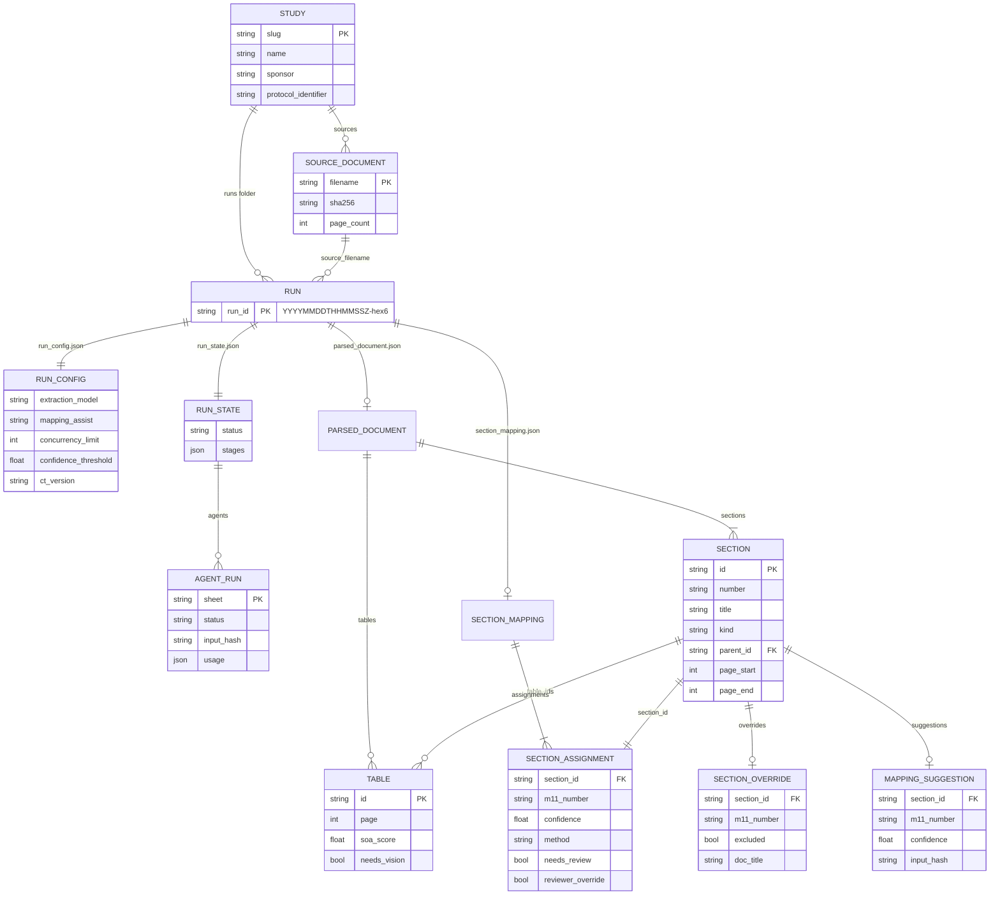

**Figure 10a — Stored entities, part 1: studies, runs, parsing and mapping.**

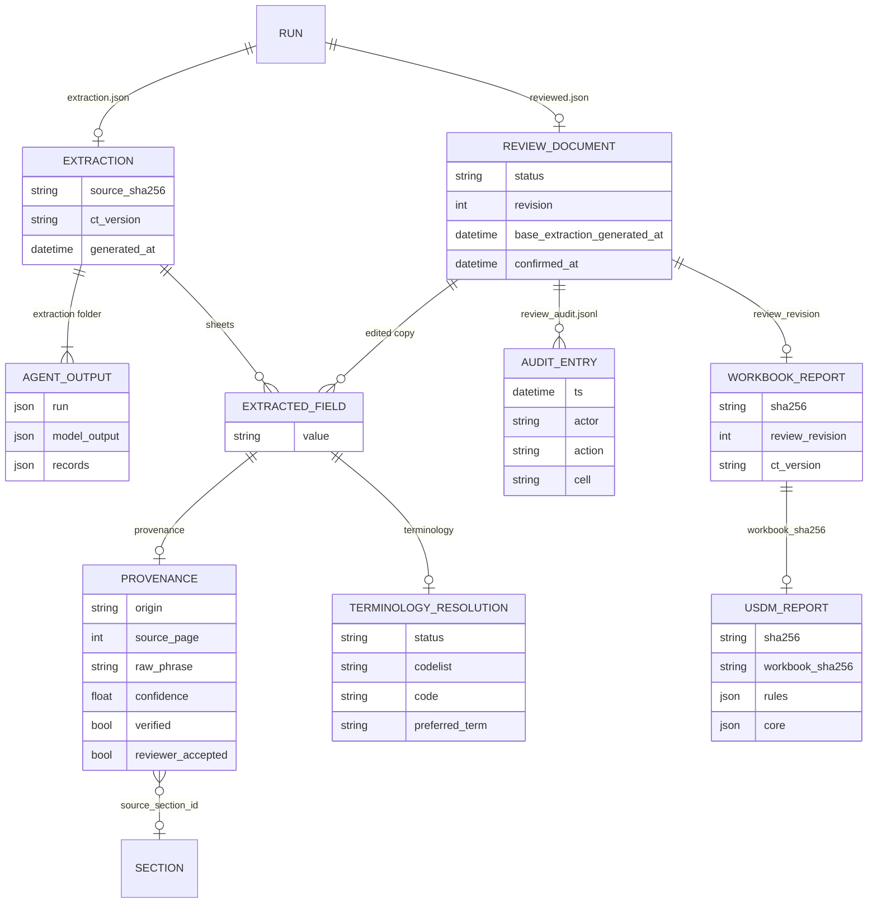

**Figure 10b — Stored entities, part 2: extraction, review and outputs.**

*How to read them:* these are **files and JSON objects, not database tables**. Each entity is a Pydantic model; relationship labels name the file or field that holds the link. Crow's-foot notation: `||` exactly one, `o|` zero or one, `|{` one or more, `o{` zero or more. Keys marked PK are unique within their parent folder or list; FK fields hold another entity's id. `SECTION` in 10b is the entity from 10a.

**Field mapping reference.** How to read the columns:

- **Method.** `LLM` means the value is read by Claude with a verified quote, `Code` means it is derived or reformatted by code, `Human` means a reviewer must supply it.
- **Workbook column.** Where the value is written, from `backend/pipeline/workbook/layout.py`.
- **USDM target.** The class and attribute in the `usdm4` model (`usdm4/api/*.py`). Attributes marked † are matched by name between workbook column and model; the importer's conversion code was not traced (**OPEN QUESTION**, see section 8).

| Protocol element | Agent | Method | Workbook sheet · column | USDM target |
|---|---|---|---|---|
| Official, brief, public, scientific title | study | `LLM` | study · officialTitle, briefTitle, publicTitle, scientificTitle | `StudyVersion.titles[]` → `StudyTitle.text` / `type` † |
| Acronym | study | `LLM` | study · studyAcronym | `StudyTitle` (acronym type) † |
| Protocol version and status | study | `LLM` CT | study · protocolVersion, protocolStatus | `StudyDefinitionDocumentVersion.version` / `status` † |
| Study rationale | study | `LLM` | study · studyRationale | `StudyVersion.rationale` |
| Approval and amendment dates | study | `LLM` CT + `Code` names | study (dates table) · name, type, date | `GovernanceDate.type`, `dateValue` |
| Sponsor, registries and their identifiers | identifiers | `LLM` CT; registries `Code`; sponsor scheme often `Human` | studyOrganizations · identifierScheme, identifier, name, type, organisationAddress; studyIdentifiers · studyIdentifier, organization | `Organization.identifierScheme`, `identifier`, `type`, `legalAddress`; `StudyIdentifier.text`, `scopeId` † |
| Study type, phase, blinding, model, intent, sub-types, characteristics | study_design | `LLM` CT | studyDesign · studyType, studyPhase, studyDesignBlindingScheme, interventionModel, trialIntentTypes, trialSubTypes, characteristics | `StudyDesign.studyType`, `studyPhase`, `characteristics`; `InterventionalStudyDesign.blindingSchema`, `intentTypes`, `subTypes`, `model` (interventionModel) † |
| Design description and rationale | study_design | `LLM` | studyDesign · studyDesignDescription, studyDesignRationale | `StudyDesign.description`, `rationale` |
| Arms | study_design_arms | `LLM` CT + `Code` names | studyDesignArms · name, description, label, type, dataOriginType, dataOriginDescription | `StudyArm.type`, `dataOriginType`, `dataOriginDescription` |
| Planned enrolment, age, sex, healthy volunteers | populations | `LLM` + `Code` formats | studyDesignPopulations · plannedAge, plannedSexOfParticipants, … | `StudyDesignPopulation.plannedAge` (Range), `plannedSex`, `plannedEnrollmentNumber`, `includesHealthySubjects` † |
| Inclusion and exclusion criteria | eligibility_criteria | `LLM` CT + `Code` names | studyDesignEligibilityCriteria · category, identifier, name, text | `EligibilityCriterion.category`, `identifier`; text in `EligibilityCriterionItem` † |
| Objectives and endpoints | objectives_endpoints | `LLM` CT + `Code` names | studyDesignOE · objectiveText, endpointText, endpointPurpose, endpointLevel, … | `Objective.text`, `level`, `endpoints[]`; `Endpoint.text`, `purpose`, `level` |
| Estimands and intercurrent events | estimands | `LLM` + `Code` linking | studyDesignEstimands · xref, summaryMeasure, endpointXref, intercurrentEvent* | `Estimand.populationSummary`, `variableOfInterestId`, `intercurrentEvents[]` (`IntercurrentEvent.strategy`) † |
| Interventions, route, dose, frequency, duration | interventions | `LLM` CT + `Code` quantities | studyInterventions · name, role, type, administrationRoute, administrationFrequency, … | `StudyIntervention.role`, `type`, `administrations[]`; `Administration.route`, `dose` (Quantity), `frequency`, `duration` |
| Indications | indications | `LLM`; rare disease judged | studyDesignIndications · name, description, isRareDisease | `Indication.isRareDisease`; `codes` left empty |
| Amendments | amendments | `LLM` CT + `Code` date link | studyAmendments · number, summary, date, geographicScope, enrollment | `StudyAmendment.number`, `summary`, `primaryReason`, `geographicScopes` † |
| Abbreviations | abbreviations | `LLM` | abbreviations · abbreviatedText, expandedText | `Abbreviation.abbreviatedText`, `expandedText` |
| Study periods | schedule | `LLM` CT | studyDesignEpochs · name, label, type | `StudyEpoch.type` |
| Visits | schedule | `LLM` + `Code` defaults | studyDesignEncounters · name, label, type, contactModes, window | `Encounter.type`, `contactModes`, `environmentalSettings` |
| Visit timing and windows | schedule | `LLM` offsets + `Code` anchor, S2S | studyDesignTiming · type, from, to, timingValue, toFrom, window | `Timing.type`, `value`, `relativeToFrom`, `relativeFromScheduledInstanceId`, `windowLower`/`windowUpper` † |
| Timeline, columns, marks | schedule | `LLM` marks + `Code` structure | timeline sheets · timepoint rows, activity rows, X marks | `ScheduleTimeline`, `ScheduledActivityInstance.activityIds`, `encounterId`, `epochId` † |
| Activities | schedule | `LLM` | studyDesignActivities · name, label | `Activity` |
| Biomedical Concepts per activity | assessments + assembly | `LLM` measurements + `Code` exact catalogue match | timeline sheet · BC/Procedure column | `Activity.biomedicalConceptIds` / `bcSurrogateIds` † |
| Elements and arm × epoch cells | assembly | `Code` documented default | studyDesignElements; studyDesign grid | `StudyElement`, `StudyCell.armId`, `epochId`, `elementIds` |

**Not produced** (D17, `FINDING_NOTES`): `studyProducts` / `AdministrableProduct`, study roles, sites, procedures, timeline planned duration, amendment impacts and changes, indication and intervention codes, therapeutic areas, narrative content.

</details>

## 6. Error handling, retries and failure modes

**In brief.** Failures are recorded where they happen and shown on the run page; nothing fails silently.

- **Claude API errors.** Retried by the Anthropic SDK up to six times; after that the affected agent is marked failed and its data is left out of the draft.
- **Section mapping failures.** A failure in Claude's section mapping never stops parsing; the title-based mapping is used instead.
- **Server stops.** A server stop marks the running job as failed.
- **Recovery.** Most failures are fixed by clicking the resume button, which re-does only what is missing or changed.

<details class="detail">
<summary>In detail</summary>

**Retries.**

- **LLM transport.** `anthropic.AsyncAnthropic(max_retries=MAX_RETRIES)` with `MAX_RETRIES = 6` (`llm.py`). The SDK retries connection errors, 408, 409, 429 and 5xx with exponential backoff.
- **Timeouts.** No explicit timeout is configured, so SDK defaults apply; calls stream to avoid HTTP timeouts on long outputs.
- **Model output problems.** Refusal (`stop_reason == "refusal"`), truncation (`max_tokens`) and missing parsed output are not retried; they raise `LlmOutputError` with usage.
- **File replace on Windows.** Nine backoff attempts (`fs._REPLACE_DELAYS`).
- **Application level.** There is no automatic retry of a failed agent, stage or run.

| Failure | Where handled | Visible effect | Recovery |
|---|---|---|---|
| Invalid upload | `StudyStore.add_source` | `422` with reason | upload a valid PDF |
| Parse exception | `JobRunner._ingest` → `_fail` | run `failed`, `ingest` stage error `Type: message` | fix input, **Re-run** (`POST ingest`) |
| No numbered headings or no SoA table | `PyMuPdfExtractor.extract` | `parsed_document.warnings` | map sections manually; move start pages |
| No API key during parsing | `JobRunner._assist` | segment note "title-based mapping only: ANTHROPIC_API_KEY is not configured" | add key, re-run ingestion |
| Claude mapping error (any batch) | `_assist` catches all exceptions | note "Claude mapping failed (ExceptionType)"; results of other batches are not saved | re-run ingestion or **Re-run Claude mapping** |
| Claude re-mapping from the UI fails | `create_mapping_suggestions` | uncaught SDK errors propagate as `500`; `SuggestionError` → `422` | retry |
| Agent has no mapped sections | `_run_agent` | agent `failed` "no protocol sections relevant to this sheet" (or empty sheet when allowed) | map sections, resume |
| Agent API or output error | `_run_agent` | agent `failed` with `Type: message`; usage still logged; stage `failed`; run still `awaiting_review` if other sheets produced | resume extraction |
| CT version changed | `_extract` | run `failed`: "run is pinned to CDISC CT …" | start a new run |
| Mapping edit while job active | `runs._remap` | `409` | wait |
| Review revision conflict | `ReviewService.apply/confirm/restart` | `409` with `current_revision`; UI reloads and keeps queued edits | save again |
| Blocking review issues | `confirm`, `generate_workbook` | `422` / `409` with issue list | fix cells |
| Import produced no USDM | `generate_usdm` | stage `failed`, report with `file: null` and import errors | fix workbook values in review |
| CORE unavailable or failing | `_core` | "CORE not run" with reason; rule results kept | build the CORE cache (needs CDISC Library access) |
| Server stopped mid-stage | `StudyStore.mark_interrupted_runs` at startup | run `failed`, stage error "interrupted: the server stopped while this stage ran" | resume |
| Corrupt `study.json` or `run_state.json` | `list_studies`, `list_runs` | skipped with a warning log; other studies still listed | repair the file |
| Obsolete reviewer override or boundary after re-parse | `map_sections`, `apply_boundaries` | listed in `ignored_overrides` / document warnings | redo the correction |

**Observability.**

- **Server logs.** JSON lines on stdout (`logging_setup.JsonFormatter`) with `extra` fields as top-level keys; uvicorn loggers are routed through it.
- **Secret redaction.** `Redactor` replaces configured secret values (≥ 8 characters) and anything shaped like `sk-ant-…` in every record.
- **Per-run records.** `run.log` holds cost and latency per model call, including Anthropic `request_id`. `run_state.json` holds stage details and errors, and agent warnings are shown in the Extraction tab.
- **Not present.** Metrics, tracing and alerting.

</details>

## 7. Configuration, environment and deployment

**In brief.** Setup is two terminals on one computer: the Python backend and the Vite frontend. The only required secret is an Anthropic API key in a `.env` file that is never committed. Per-run behaviour (model, concurrency, confidence threshold, whether Claude maps sections) is stored in each run's `run_config.json`. There is no login and no production deployment setup.

<details class="detail">
<summary>In detail</summary>

**Environment** (`backend/config.py:Settings`, loaded from the environment and the repo-root `.env`).

| Variable | Default | Effect |
|---|---|---|
| `ANTHROPIC_API_KEY` | none | enables Claude mapping and extraction; without it parsing still works with title-based mapping, and extraction returns `422` |
| `CDISC_API_KEY` | none | optional; passed to `validate_core` when the CORE cache exists |
| `STUDIES_ROOT` | `<repo>/studies` | data root; relative paths resolve against the repo |
| `MAX_UPLOAD_MB` | 200 | upload limit |
| `LOG_LEVEL` | `INFO` | root log level |
| `API_TARGET` (frontend) | `http://127.0.0.1:8000` | Vite proxy target (`frontend/vite.config.ts`) |

**Per-run configuration** (`backend/models/run_config.py:RunConfig`, written at run creation).

| Field | Default | Used by |
|---|---|---|
| `pdf_backend` | `pymupdf` | `extractors/registry.get_extractor` |
| `page_image_dpi` | 150 (50–300) | page renders, parse cache key |
| `segmentation_review_threshold` | 0.70 | mapping review flags |
| `mapping_assist` | `all` (`flagged`, `off`) | Claude mapping scope |
| `extraction_model` | `claude-sonnet-5` | agents and section mapper |
| `extraction_effort` | none (model default) | `output_config.effort` |
| `concurrency_limit` | 5 (1–32) | extraction semaphore |
| `confidence_threshold` | 0.7 | provenance and review warnings |
| `ct_version` | pinned at first extraction | CT consistency check |

`POST /runs` accepts only `source_filename`, `pdf_backend` and `page_image_dpi`. The other fields have no UI or API setter; they are changed by editing `run_config.json` in the run folder. The model price table (`llm.py:PRICING`) covers `claude-fable-5-1`, `claude-opus-5`, `claude-sonnet-5` and `claude-haiku-4-5`; other models are logged with cost 0.

**Running** (README "Setting up on a new machine").

```bash
uv sync                                   # Python 3.12 (pinned: usdm4 needs >=3.12,<3.13)
cd frontend && pnpm install && cd ..
cp .env.example .env                      # add ANTHROPIC_API_KEY
uv run uvicorn backend.main:create_app --factory --reload --port 8000
cd frontend && pnpm dev                   # http://localhost:5173
```

**Checks.** `uv run pytest` (24 test modules; model calls use `FakeLlm`, so tests need no network), `uv run ruff check`, `uv run mypy` (strict), `pnpm build` (strict TypeScript).

**Authentication and access.** None. `LOCAL_ACTOR = "local-user"` is written to every audit line. CORS admits only the Vite dev origins, but CORS does not restrict non-browser clients; access control relies on the server listening on the loopback interface. Uvicorn binds 127.0.0.1 by default and the README command does not change that.

**Deployment.**

- **No production path.** The FastAPI app does not serve the built frontend (no `StaticFiles` mount in `backend/main.py`), and there is no Dockerfile or process manager configuration. The only documented way to run the UI is the Vite dev server with its `/api` proxy.
- **Backend on another port.** The proxy target is fixed at `127.0.0.1:8000` unless `API_TARGET` is set, so a backend started on a different port leaves the page unable to load data.

**Data leaving the machine.**

- **Anthropic API.** Protocol section text sent to agents; page images of schedule pages; section titles and the first 700 characters of each section for mapping.
- **CDISC Library API.** Contacted only if a CORE cache is being built or `validate_core` needs it.
- **Other clouds.** No cloud PDF services are used (D4).

</details>

## 8. Known limitations and open questions

**In brief.** The unreviewed draft is incomplete by design and several USDM areas are not extracted at all, so human review is essential. The tool is local, single-user and not validated for regulated use. A few behaviours could not be confirmed from the code and are listed as open questions.

<details class="detail">
<summary>In detail</summary>

**Limitations (confirmed in code or decisions).**

1. **Accuracy.** Unreviewed accuracy on the CDISC Pilot is F1 53.3% (precision 64.7%, recall 45.3%). Recall including reference content outside the pipeline's scope is 18.6%. The measurement predates Claude and reviewer mapping.
2. **Scanned PDFs.** No OCR; image-only protocols produce no text.
3. **One PDF backend.** Only PyMuPDF is registered; Docling (D4) is not implemented.
4. **Not extracted.** Administrable products, roles, sites, procedures, timeline durations, amendment impacts and changes, narrative content, coded indications and interventions.
5. **Generated defaults to check.** Elements and arm × epoch cells are a documented default (D24); encounter setting and contact mode default to Clinic / In Person; a schedule without a marked anchor uses the first timepoint.
6. **Single process.** In-process locks only; two backend processes on one data root are unsafe. The job pool has two workers for the whole app.
7. **No auth, no GxP validation.** One implicit user; no e-signature on confirm.
8. **Polling only.** Progress updates arrive within 1 s while active and within 10 s when idle; long synchronous calls (Claude re-mapping, about 50 s for 146 sections) block that browser request.
9. **Run settings not editable in the UI.** The model, concurrency, thresholds and mapping scope are set by editing `run_config.json`.
10. **Stale text in the code.**
    - `ReviewPage.tsx` confirm dialog ("arrive in later phases").
    - `suggest.py` docstring and `SYSTEM` prompt (describe accept/reject suggestions).
    - `schedule.py` docstring ("not invented" versus the Clinic / In Person defaults).
    - D8 ("no LLM").
11. **Unused dependencies.** `tenacity`, `httpx`.
12. **Sample data in git.** `studies/cdisc-pilot` and `studies/paloma-3` are tracked although `studies/` is gitignored.

**Open questions.**

1. **OPEN QUESTION:** How does `usdm4-excel` map each workbook column to USDM attributes, and how does it generate ids? The mapping table marks inferred attributes with †; the importer ships without a public source repository (D1).
2. **OPEN QUESTION:** What does a user see for a scanned PDF? Only the "no numbered body sections detected" warning was confirmed in code.
3. **OPEN QUESTION:** When one Claude mapping batch fails, answers from the batches that succeeded in the same call are discarded (`suggest_mappings` writes only after `asyncio.gather` returns). Is that intended, or should partial results be stored?
4. **OPEN QUESTION:** Review operations are accepted while an extraction job runs on the same run; the review would then become `stale` when extraction finishes. Should editing be blocked during extraction?
5. **OPEN QUESTION:** `usdm/<slug>.json` is written non-atomically (`Path.write_text`) unlike other artefacts. Is that deliberate?
6. **OPEN QUESTION:** What is the intended deployment beyond local development (serving `frontend/dist`, binding, authentication)? Nothing in the repository defines it.

</details>

## 9. Glossary

| Term | Meaning in this system |
|---|---|
| **USDM** | CDISC Unified Study Definitions Model: a standard, machine-readable representation of a study definition. Version 4 is the target here. |
| **USDM workbook** | An Excel file whose sheets describe a study in the layout `usdm4-excel` imports. This system writes the legacy single-workbook dialect. |
| **usdm4 / usdm4-excel** | Python packages: `usdm4` holds the USDM model, bundled CDISC terminology, the BC catalogue and the DDF rule library. `usdm4-excel` converts a workbook to USDM JSON. |
| **ICH M11** | The ICH harmonised clinical protocol template (CeSHarP). Its numbered sections (e.g. 1.3 Schedule of Activities, 5 Trial Population) are the common map every protocol is sorted onto. |
| **Protocol section** | A heading and its own text in the PDF, as parsed (`Section`, ids like `sec-5.3`, `fm-synopsis`, `app-…`). |
| **Section mapping** | The assignment of each protocol section to one or more M11 sections, with method, confidence and review flag. |
| **SoA** | Schedule of Activities: the grid of visits and procedures. Parsed tables scoring ≥ 0.5 are SoA candidates. |
| **Epoch** | A study period such as screening, treatment or follow-up (`StudyEpoch`). |
| **Encounter** | A planned visit or contact (`Encounter`). |
| **Timeline, timepoint, timing** | A schedule (`ScheduleTimeline`), one column in it (`ScheduledActivityInstance`), and the planned time of a timepoint relative to the anchor (`Timing`). |
| **Anchor** | The visit that other visit times are measured from (Fixed Reference timing), for example Day 1. |
| **Arm, element, cell** | A treatment group (`StudyArm`), a building block of what happens in an epoch (`StudyElement`), and the element(s) for one arm in one epoch (`StudyCell`). |
| **Estimand, intercurrent event** | The precise treatment effect to be estimated, and events after treatment start (e.g. discontinuation) that affect its interpretation, each with a handling strategy. |
| **CDISC CT** | CDISC Controlled Terminology: codelists of allowed terms, each with a C-code (e.g. `C15601`), submission value, preferred term and synonyms. |
| **BC** | Biomedical Concept: a CDISC definition of what is measured (e.g. systolic blood pressure). A *surrogate* is a name without a definition. |
| **DDF rules** | The USDM (Digital Data Flow) conformance rules, ids like `DDF00084`, run by `usdm4`. |
| **CDISC CORE** | CDISC's open rules engine; runs only when its cache has been built with CDISC Library access. |
| **Agent** | One extraction unit: a prompt, an output schema, the M11 sections it reads, and deterministic post-processing (`SheetAgent`). |
| **Cited value** | What the model returns per field: value, verbatim quote, section id, confidence. |
| **Provenance** | Where a value came from: origin, section, page, quote, confidence, verified flag, note, reviewer acceptance. |
| **Verified** | The quote was found in the protocol text by software; the page comes from that match. |
| **Extracted / derived / human** | Value origins (`ValueOrigin`): read by the model with a quote; generated by code; entered by a reviewer. A *judged* value is an extracted value the model chose rather than transcribed, capped at 0.8 confidence. |
| **Blocking issue** | A review problem that prevents confirmation: missing required value, non-exact terminology, invalid format or structure, reference problem. |
| **Run** | One processing of one source PDF with fixed settings, stored in its own timestamped folder. |
| **Stage** | A step recorded in `run_state.json`: `ingest`, `segment`, `extract`, `workbook`, `usdm`. |
| **input_hash** | SHA-256 over everything a model call would see; equal hashes mean the stored answer is reused. |
| **Resume** | Re-running a stage so that only changed or failed work is repeated. |
| **Stage A / B / C** | Extraction to the intermediate model; confirmed review to workbook; workbook to validated USDM JSON. |
